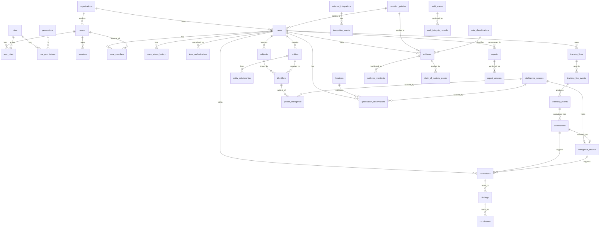

# DILIP — Technical Proposal

**Digital Investigation & Linked Intelligence Platform**
**Enterprise Architecture — Discovery Phase (Phase 0) Deliverable**

| | |
|---|---|
| **Document type** | Technical Proposal (Phase 0 — Discovery & Architecture Review) |
| **Status** | DRAFT — awaiting architecture approval before Phase 1 |
| **Version** | 0.2.0 |
| **Date** | 2026-08-11 |
| **Prepared by** | Principal Security Architect / Digital Forensics Architect / Enterprise Investigation Systems Engineer |
| **Scope** | Architecture, threat model, data model, evidence/audit/security model, ADRs. **No production code.** |
| **Supersedes** | v0.1.0 (aligned to the expanded master brief: tenancy, entity graph, phone/geo fusion, compliance model, supply-chain security, 15 ADRs, readiness verdict) |

> **Approval gate (mandatory).** This is a *proposal*, not an implementation. Per the master brief
> (§2, §38, §40) no production code, migrations, Dockerfiles, APIs, real integrations, real data
> collection, deployment, or infrastructure changes are produced until this architecture is
> reviewed and approved. Phase 1 must not begin before Phase 0 is approved. Where the brief did not
> supply information, it is recorded under **OPEN QUESTION** — never guessed.

---

## Table of Contents

1. [Executive Summary](#1-executive-summary)
2. [Current State Assessment](#2-current-state-assessment)
3. [Requirements Decomposition](#3-requirements-decomposition)
4. [Target Architecture](#4-target-architecture)
5. [Module Boundaries](#5-module-boundaries)
6. [Data Model (Logical ERD)](#6-data-model-logical-erd)
7. [Evidence Architecture](#7-evidence-architecture)
8. [Chain of Custody Architecture](#8-chain-of-custody-architecture)
9. [Immutable Audit Architecture](#9-immutable-audit-architecture)
10. [Phone Intelligence Architecture](#10-phone-intelligence-architecture)
11. [Geolocation Architecture](#11-geolocation-architecture)
12. [Intelligence, Correlation & Entity Graph](#12-intelligence-correlation--entity-graph)
13. [Security Architecture](#13-security-architecture)
14. [Threat Model](#14-threat-model)
15. [Air-Gapped Deployment](#15-air-gapped-deployment)
16. [Private Cloud Deployment](#16-private-cloud-deployment)
17. [Testing Strategy](#17-testing-strategy)
18. [Prototype Migration Matrix](#18-prototype-migration-matrix)
19. [ADR List](#19-adr-list)
20. [Risk-Ordered Implementation Roadmap](#20-risk-ordered-implementation-roadmap)
21. [Legal / Compliance Model](#21-legal--compliance-model)
22. [Data Classification, Retention & Destruction](#22-data-classification-retention--destruction)
23. [Open Questions](#23-open-questions)
24. [Architecture Readiness Verdict](#24-architecture-readiness-verdict)

---

## 1. Executive Summary

### 1.1 What DILIP is

DILIP is a **Legal / Compliance-first Digital Investigation & Linked Intelligence Platform**. It is
not a tracking service and not a data-collection dashboard. Its purpose is to link evidence, data,
and disparate sources inside a unified **Case** while preserving evidence integrity, source,
context, chain of custody, and a defensible level of confidence in every conclusion.

The investigative pipeline is a controlled, accountable chain:

```
Case → Subjects/Entities → Identifiers → Tracking/Observations → External Intelligence
     → Evidence → Correlation → Analyst Review → Findings → Conclusion → Legal Report
```

### 1.2 The governing rule (the most important rule in the project)

The platform must **never** state *"we found the phone number / the person / the location."* It must
state:

> *"This identifier was obtained from source X, at time Y, under authorization Z; its provenance is
> preserved; the following evidence supports its association with entity A; confidence is B; there
> is / is not conflicting evidence; and these are the steps the analyst took to reach the
> conclusion."*

The same discipline applies to location: not *"the subject is at place X"* but *"there are three
geolocation observations from different sources, each with accuracy/confidence/provenance; they
agree / conflict; the analyst reviewed them."*

Consequently these equivalences are **forbidden** and are prevented structurally, not just in the UI:

```
Tracking Link ≠ Person   Phone ≠ Person   IP ≠ Person   Location ≠ Person   Device ≠ Person
```

All of these are **evidence / observations / intelligence signals** requiring correlation and human
attribution.

### 1.3 The semantic ladder (never short-circuited)

```
Raw Observation → Normalized Observation → Evidence/Intelligence → Correlation → Analyst Review → Finding/Conclusion
```

Every stored claim carries a **semantic tier** — FACT / INTELLIGENCE / CORRELATION / CONCLUSION —
and the system **never auto-promotes** a lower tier to a higher one. `CORRELATION → FACT` requires an
audited human decision.

### 1.4 The nine questions every datum must answer

For **any** result the platform holds, these must be answerable from the record itself:

> Where did it come from? When was it collected? By what method? Under what authority? Who accessed
> it? Has it changed? What is our confidence? How does it link to other evidence? Who approved it?

If they cannot be answered, the data is **not legal-grade evidence** — no matter how polished the
interface. This drives the provenance, custody, and audit architecture throughout.

### 1.5 What we propose

- Evolve the single-file FastAPI + SQLite + CDN-React prototype into a **modular monolith** (FastAPI
  backend, separate React/Vite frontend, PostgreSQL) with strong module boundaries permitting later
  service extraction.
- Make **provenance, confidence, evidence integrity, chain of custody, tamper-evident audit,
  semantic tiers, and human review** first-class from Phase 1 — never retrofitted.
- Enforce **case isolation and tenant isolation**: an investigator on Case A never automatically
  reaches Case B; RBAC is layered with case-level + attribute/classification-based checks (ABAC).
- Route **all** sensitive external contact through a single **Authorized Integration Gateway**
  (authN, authZ, mTLS, purpose binding, data minimization, provenance, logging, failure isolation).
  DILIP is a *consumer* of authorized results — never an interception or intrusion tool.
- Support **air-gapped** and **private-cloud** deployment; no CDNs/external JS/fonts; all
  dependencies vendored, pinned, and accompanied by an **SBOM** with signed artifacts.
- Provide a **Compliance abstraction** (informed by ISO/IEC 27037 principles) without asserting
  court-admissibility from the mere presence of a hash.

### 1.6 What DILIP explicitly is not (§37)

Not an unauthorized-surveillance platform, telecom/signaling interception tool, hacking or
credential-theft platform, malware platform, open-redirect service, or arbitrary location tracker.
All telecom/signaling/identity/location intelligence enters only through authorized external systems
under proper authorization.

---

## 2. Current State Assessment

> **The prototype source is NOT present in this repository** (the repository was empty at the start
> of this engagement). Per §2 and §40 of the brief, no Current-State findings are invented. The
> description below is what the brief *states*; each claim is marked for verification against actual
> source once provided.

| Aspect | Stated in brief | To verify |
|---|---|---|
| Packaging | Single Python file (backend + frontend) | ✔ audit source |
| API | FastAPI | ✔ |
| Persistence | SQLite | ✔ |
| Frontend | React SPA inside a Python string | ✔ |
| Styling | Tailwind via CDN | ✔ |
| Telemetry | Synthetic/demo | ✔ |
| Correlation | Mock | ✔ |
| RBAC / case isolation | Unstated → assume minimal/absent | **OPEN QUESTION** |
| Evidence integrity / custody | Unstated → assume absent | **OPEN QUESTION** |
| Audit | Unstated → assume plain table or absent | **OPEN QUESTION** |

**What it proves:** the workflow shape (case → collection → telemetry → correlation → evidence →
report) and the tracking-link + dashboard interaction model.

**What it cannot do (the gap):** no trust boundary between observation/intelligence/correlation/
attribution; no evidence integrity or custody stream; no tamper-evident audit; no real RBAC/ABAC or
case/tenant isolation; SQLite's concurrency/integrity/encryption/PITR limits; CDN dependencies break
air-gap; frontend-in-a-string is untestable; open-redirect/SSRF posture unverified; mock correlation
presents inferences without provenance/confidence. Dispositions are in [§18](#18-prototype-migration-matrix).

---

## 3. Requirements Decomposition

Requirements are grouped as **Functional (FR)**, **Non-Functional (NFR)**, **Security (SEC)**,
**Compliance (COMP)**, **Evidence (EVID)**, and **Intelligence (INT)**, each with stable IDs
referenced across the document.

### 3.1 Functional (FR)

| ID | Requirement |
|---|---|
| FR-1 | Create and manage full Investigation Cases across the lifecycle DRAFT → OPEN → ACTIVE → UNDER_REVIEW → SUSPENDED → CLOSED → ARCHIVED. |
| FR-2 | Model Subjects/Entities, Identifiers, Observations, Evidence, Correlations, Findings, Conclusions, and Reports within a Case. |
| FR-3 | Create authorized tracking/investigation links bound to case, objective, campaign/link ID, destination, expiration, status, authorization. |
| FR-4 | Ingest tracking telemetry and normalize it through the semantic ladder (raw → normalized → evidence/intelligence). |
| FR-5 | Support three independent phone-intelligence paths (authorized call records; authorized OSINT; authorized telecom/signaling) plus a fusion layer. |
| FR-6 | Support three independent geolocation paths (IP; Wi-Fi/BSSID; cell/tower) plus a fusion layer that surfaces conflicts. |
| FR-7 | Provide an Entity Graph (nodes + typed relationships with confidence + provenance) and a Correlation Engine producing *candidate* relationships for human review. |
| FR-8 | Produce re-verifiable, versioned Investigation Reports containing evidence hashes, custody, correlations, conflicts, findings, analyst attribution, confidence, conclusions, audit references. |
| FR-9 | Provide dashboards: case overview, timeline, event/observation explorer, entity/intelligence graph, correlation workspace, evidence vault, custody viewer, audit viewer, reports, access management, system health. |

### 3.2 Non-Functional (NFR)

| ID | Requirement |
|---|---|
| NFR-1 | Identifiers are stable, collision-resistant, DB-safe, globally unique, reproducible where required; `hash()` and process-seeded schemes are prohibited. |
| NFR-2 | Air-gapped operation: no CDN/external JS/fonts/APIs except via the approved gateway; deps vendored, mirrored, version-pinned; offline package repo. |
| NFR-3 | Private-cloud operation: private networking, internal LB, private PostgreSQL/object storage, internal IdP, secrets manager, centralized logging, backup/DR. |
| NFR-4 | Reliability: backups + PITR + evidence/audit backup + DR with **tested restore**, defined RTO/RPO, health checks, structured logging, metrics, alerting, failure isolation. |
| NFR-5 | Performance/scale to be sized against confirmed investigator count, case/evidence/telemetry volumes (Open Questions). |
| NFR-6 | Explainability: every correlation and conclusion is reconstructable ("why were these linked?"). |

### 3.3 Security (SEC)

| ID | Requirement |
|---|---|
| SEC-1 | Zero-Trust principles; strong authentication; MFA; least privilege. |
| SEC-2 | RBAC **plus** case-level authorization **plus** classification/attribute-based restrictions (ABAC). Investigator on Case A cannot access Case B by default. |
| SEC-3 | Tenant/organization isolation where multi-tenant. |
| SEC-4 | Encryption at rest and in transit; mTLS on sensitive boundaries; secrets & key management (no secrets in source). |
| SEC-5 | Secure session management; token revocation; secure logging with redaction. |
| SEC-6 | SSRF protection and open-redirect prevention on tracking destinations; input validation; security headers; rate limiting. |
| SEC-7 | Supply-chain security: dependency management, vulnerability scanning, **SBOM**, signed artifacts. |
| SEC-8 | All external intelligence enters only via the Authorized Integration Gateway; no external system reaches the core DB. |

### 3.4 Compliance (COMP)

| ID | Requirement |
|---|---|
| COMP-1 | Compliance abstraction that binds later to the actual governing legal/regulatory regime (not assumed). |
| COMP-2 | Handling informed by ISO/IEC 27037-style digital-evidence principles: identification, collection, acquisition, preservation. |
| COMP-3 | Data classification (PUBLIC…HIGHLY_RESTRICTED) governing access, encryption, export, retention, audit, reporting. |
| COMP-4 | Retention policies, case-specific retention, legal hold, controlled destruction with destruction evidence; no ad-hoc delete of evidence. |
| COMP-5 | Every collection bound to purpose + authorization + data type + retention + access policy (data minimization). |
| COMP-6 | No claim of court-admissibility from a hash alone; admissibility depends on jurisdiction, procedure, authorization, and the full collection process. |

### 3.5 Evidence (EVID)

| ID | Requirement |
|---|---|
| EVID-1 | Encrypted Evidence Vault: at-rest & in-transit encryption, content hashing (SHA-256 minimum, SHA-512+ optional), content-addressed storage, WORM-compatible, signed manifests, full metadata + provenance. |
| EVID-2 | Originals immutable after ingestion; any content change is detectably surfaced. |
| EVID-3 | Full chain of custody as an append-only event stream recording who/what/when/why/from/to/authorization/previous-hash/new-hash; fully reconstructable. |
| EVID-4 | Evidence integrity is *provable*: the displayed artifact is byte-identical to the collected one. |
| EVID-5 | Reports are re-verifiable against the evidence they cite. |

### 3.6 Intelligence (INT)

| ID | Requirement |
|---|---|
| INT-1 | Every intelligence datum carries source, timestamp, collection method, authorization context, confidence, provenance, semantic tier. |
| INT-2 | OSINT results are stored as INTELLIGENCE, never auto-promoted to FACT; promotion requires sufficient evidence + human review. |
| INT-3 | The Correlation Engine is logically separate from the Evidence Store and never writes conclusions directly; it emits candidate relationships + confidence for analyst review. |
| INT-4 | Confidence ≠ Fact: no automatic CORRELATION → FACT transition without human attribution. |
| INT-5 | Conflicting intelligence/geolocation is never hidden; conflicts are surfaced and preserved with per-source provenance. |
| INT-6 | Conclusions are explainable, evidence-backed, attributable to a named analyst, and audited. |

---

## 4. Target Architecture

### 4.1 Style — Modular Monolith first (ADR-007)

One deployable backend, strong internal module boundaries, each module owning its domain, services,
repository, API surface, and tests. Boundaries are drawn so a module (e.g. Integration Gateway,
Intelligence) can be extracted to a service later *if a real need appears*. Premature microservices
are rejected: they would multiply the security surface, the audit-consistency problem, and
operational cost before the domain stabilizes.

### 4.2 Component view

```
┌───────────────────────────────────────────────────────────────────────┐
│         React Frontend (Vite build, self-hosted, no CDN)               │
│  Case · Timeline · Observation Explorer · Entity/Intel Graph ·         │
│  Correlation Workspace · Evidence Vault · Custody · Audit ·            │
│  Reports · Access Mgmt · System Health                                 │
└───────────────────────────────┬───────────────────────────────────────┘
                                 │  HTTPS (mTLS optional), MFA, session tokens
                                 ▼
┌───────────────────────────────────────────────────────────────────────┐
│                         API Layer (FastAPI)                            │
│  AuthN(MFA) · Policy Decision Point [RBAC+Case+ABAC+Tenant+Legal] ·    │
│  Input validation · Rate limiting · SSRF/redirect guard · Sec headers  │
└───────────────────────────────┬───────────────────────────────────────┘
                                 │  typed in-process module calls
   ┌──────────┬───────────┬──────┴────┬───────────┬───────────┬──────────┐
   ▼          ▼           ▼           ▼           ▼           ▼          ▼
identity   cases    tracking/    intelligence  correlation  geolocation phone-
& access          telemetry     & entity graph            intelligence intel
   │          │           │           │           │           │          │
   └────┬─────┴─────┬─────┴─────┬─────┴─────┬─────┴─────┬─────┴────┬─────┘
        ▼           ▼           ▼           ▼           ▼          ▼
     evidence     audit     reporting    compliance   integration gateway
        │           │           │            │              │
   ┌────┴───────────┴───────────┴────────────┴───────┐      ▼
   ▼                                                  ▼   ┌────────────────────────┐
┌──────────────┐  ┌────────────────┐  ┌──────────────┐   │ Authorized External     │
│ PostgreSQL   │  │ Evidence Store │  │ Audit Store  │   │ Systems (telecom, OSINT,│
│ (encrypted,  │  │ (content-addr, │  │ (append-only │   │ IP-geo, Wi-Fi, cell) —  │
│  PITR)       │  │  WORM)         │  │  hash chain, │   │ each behind authZ+mTLS  │
│              │  │                │  │  WORM anchor)│   └────────────┬───────────┘
└──────────────┘  └────────────────┘  └──────────────┘                │
        ▲                                                              │
        └──────────────── gateway is the ONLY egress ─────────────────┘
```

### 4.3 Cross-cutting concerns (present from Phase 1)

- **Provenance envelope** on every externally-sourced datum (source, method, time, authorization,
  classification, confidence, retention) — enforced at the repository layer (ADR-003/009/010).
- **Semantic tier tag** on every claim (ADR-011); no auto-promotion.
- **Transactional audit interceptor** on security-relevant operations (ADR-005).
- **Single Policy Decision Point** consulted by every module: RBAC + case-level + ABAC/classification
  + tenant + legal-authorization boundary (ADR-006).
- **Case & tenant isolation** enforced at the query layer (row-level scoping), not only in handlers.

### 4.4 Technology baseline (subject to ADRs)

| Concern | Choice | ADR |
|---|---|---|
| Backend | FastAPI, Python 3.12+ | — |
| Relational DB | PostgreSQL 16+ | ADR-001 |
| Identifiers | UUIDv7 (PK) / ULID (public tokens) / UUIDv5 (deterministic) | ADR-002 |
| Evidence store | Content-addressed WORM + multi-hash + signed manifests | ADR-003 |
| Custody | Append-only, hash-linked custody stream | ADR-004 |
| Audit | Append-only + hash chain + signed checkpoints + WORM anchor | ADR-005 |
| AuthZ | RBAC + ABAC + case/tenant isolation | ADR-006 |
| Architecture | Modular monolith | ADR-007 |
| External egress | Single Authorized Integration Gateway | ADR-008 |
| Phone intelligence | 3 authorized paths + fusion | ADR-009 |
| Geolocation | 3 authorized paths + conflict-surfacing fusion | ADR-010 |
| Semantic tiers | FACT/INTELLIGENCE/CORRELATION/CONCLUSION, no auto-promotion | ADR-011 |
| Classification | PUBLIC…HIGHLY_RESTRICTED | ADR-012 |
| Retention | Policies + legal hold + controlled destruction | ADR-013 |
| Air-gap | Vendored deps, SBOM, local trust anchors | ADR-014 |
| Private cloud | Private infra topology | ADR-015 |

---

## 5. Module Boundaries

Each module owns its tables (no cross-module raw SQL), exposes a typed service interface, and is
independently testable. All external network calls originate only in the Integration Gateway.

```
backend/modules/
    identity/        — users, roles, permissions, sessions, MFA; RBAC+ABAC policy decision point
    cases/           — case lifecycle, members, authorizations, subjects, entities, identifiers, timeline
    tracking/        — investigation links, destination validation, telemetry ingestion & normalization
    intelligence/    — intelligence sources/records, enrichment adapters, entity graph, risk scoring
    correlation/     — candidate relationships, confidence, explanation, analyst-review workflow
    geolocation/     — IP / Wi-Fi-BSSID / cell paths + fusion + conflict detection
    phone/           — call-records / OSINT / telecom paths + phone-identity fusion
    evidence/        — evidence vault, hashing, manifests, integrity verification, retention/legal hold
    custody/         — append-only chain-of-custody event stream
    audit/           — append-only, hash-chained audit + integrity verification
    reporting/       — versioned, re-verifiable reports; signed export
    integrations/    — Authorized Integration Gateway; connector registry; purpose binding; logging
    compliance/      — classification, retention policies, legal authorizations, compliance abstraction
```

| Module | Responsibility | Key owned tables |
|---|---|---|
| identity | AuthN/MFA, sessions, RBAC+ABAC decisions | users, roles, permissions, role_permissions, user_roles, sessions |
| cases | Case lifecycle, members, subjects/entities/identifiers, authorizations | cases, case_members, case_status_history, subjects, entities, identifiers, entity_relationships, legal_authorizations |
| tracking | Links, destination security, telemetry | tracking_links, tracking_link_events, telemetry_events, observations |
| intelligence | Sources, records, enrichment, entity graph | intelligence_sources, intelligence_records |
| correlation | Candidate links, confidence, review | correlations |
| geolocation | 3 geo paths + fusion | locations, geolocation_observations |
| phone | 3 phone paths + fusion | phone_intelligence |
| evidence | Vault, hashing, manifests, integrity | evidence, evidence_manifests |
| custody | Custody event stream | chain_of_custody_events |
| audit | Tamper-evident audit | audit_events, audit_integrity_records |
| reporting | Versioned re-verifiable reports | reports, report_versions |
| integrations | Single external egress boundary | external_integrations, integration_events |
| compliance | Classification, retention, legal | retention_policies, data_classifications |

**Boundary rules (ADR-007):** (1) a module never reads another's tables directly; (2) all egress is
via `integrations`; (3) `audit`/`custody`/`evidence` expose no update/delete of integrity records;
(4) every data access passes the identity policy decision point with case+tenant scoping.

---

## 6. Data Model (Logical ERD)

**Engine:** PostgreSQL 16+. PKs `uuid` (UUIDv7). Human identifiers (case/evidence numbers) are
separate unique columns. `timestamptz` UTC. Native enums for closed sets. FKs, unique constraints,
check constraints, and indexes on FK/lookup/time columns throughout. Append-only and
immutable-after-ingestion tables enforce integrity via revoked UPDATE/DELETE grants + triggers.
Full column catalogue: [architecture/data-model.md](./architecture/data-model.md).



**Table groups (§25 tables mapped):** identity (`users, roles, permissions, sessions,
role_permissions, user_roles`); cases (`cases, case_members, subjects, entities, identifiers,
entity_relationships, case_status_history, legal_authorizations`); tracking (`tracking_links,
telemetry_events, observations, tracking_link_events`); intelligence (`intelligence_sources,
intelligence_records`); correlation (`correlations, findings, conclusions`); geolocation
(`locations, geolocation_observations`); phone (`phone_intelligence`); evidence (`evidence,
evidence_manifests, chain_of_custody_events`); audit (`audit_events, audit_integrity_records`);
integrations (`external_integrations, integration_events`); governance (`retention_policies,
data_classifications`); reporting (`reports, report_versions`); tenancy (`organizations`).

*Additions beyond the brief's list, required by the governing principle: `organizations` (tenancy),
`entity_relationships` (entity graph edges), `report_versions` (versioning), `audit_integrity_records`
(audit anchoring), `role_permissions`/`user_roles` (RBAC join), `data_classifications`. Rationale in
the data-model doc and ADRs.*

---

## 7. Evidence Architecture

Not a table — a subsystem enforcing **immutability + provable integrity** (EVID-1…4, ADR-003).

```
Ingestion:
  artifact bytes
    → compute SHA-256 (+ SHA-512 for high-value)
      → storage_address = content digest  (content-addressed store, WORM, encrypted at rest)
        → write evidence + evidence_manifests (single tx)
          → emit chain_of_custody_events(action=COLLECTED, prev_hash→new_hash)
            → emit audit_event (transactional)
```

- **Content-addressed storage**: the storage key *is* the SHA-256 digest → altered bytes cannot
  resolve to the same address.
- **Multi-algorithm hashing** (SHA-256 always; SHA-512 for high-value) guards against future
  algorithm weakness.
- **Signed manifests** list `{evidence_number, storage_address, hashes, classification}` and are
  cryptographically signed; per-case and per-export manifests exist.
- **Timestamping** binds integrity attestation to a time (trust anchor is an Open Question in
  air-gapped mode).
- **Verification op** `VERIFY EVIDENCE` recomputes hashes from stored bytes, compares to manifest →
  PASS/FAIL, itself audited.
- **Encryption** at rest (store + backups) and in transit (TLS/mTLS).
- **No update/delete path** in the evidence interface; disposition only via governed
  retention/destruction ([§22](#22-data-classification-retention--destruction)) and never under legal
  hold.

---

## 8. Chain of Custody Architecture

Custody is an **append-only event stream** (EVID-3, ADR-004), not a status string.

```
Evidence ─▶ COLLECTED ─▶ IMPORTED ─▶ VERIFIED ─▶ ACCESSED ─▶ TRANSFERRED
         ─▶ REVIEWED ─▶ REFERENCED_IN_REPORT ─▶ ARCHIVED
```

Each `chain_of_custody_events` row records: **who** (actor+role), **what** (action), **when**,
**why** (reason), **from where / to where**, **authorization**, **previous_hash**, **new_hash**,
session/IP. Events are hash-linked (`new_hash = H(canonical(event) || previous_hash)`) so any
content or ordering change is detectable, and the **complete history is reconstructable** by
replaying the stream. Custody events are append-only (UPDATE/DELETE revoked).

---

## 9. Immutable Audit Architecture

An ordinary "immutable" table is not accepted. Design is **tamper-evident** (SEC-5, ADR-005):

```
Action → Audit Event (canonicalized)
       → event_hash = H(canonical(event) || prev_event_hash)
         → append-only store (UPDATE/DELETE grants revoked)
           → monotonic seq (gap-detected)
             → periodic signed checkpoint → audit_integrity_records
               → external / WORM anchoring
```

- **Append-only + hash chain**: altering/removing any event breaks the chain from that point;
  `seq` detects gaps/reordering independently.
- **Signed checkpoints** + **WORM/external anchoring** allow fast verification and protect against
  application-layer compromise: even a compromised app cannot silently rewrite anchored history
  without breaking signatures held outside the app trust boundary.
- **Admin cannot delete the audit trail** with ordinary application-admin rights: UPDATE/DELETE are
  revoked at the DB role level; the anchoring key is held separately (KMS / offline), so tampering
  is *detectable* even under partial compromise (defense discussed in ADR-005).
- **Verification op** `VERIFY AUDIT INTEGRITY` → PASS/FAIL, reporting the first divergent `seq`;
  the run is itself audited.
- Security-relevant audit events are written **transactionally** with the action they describe.

---

## 10. Phone Intelligence Architecture

**Core rule:** DILIP does not "learn the phone number" because someone visited a link. Any
phone-identity signal enters through one of three **separate, authorized** paths, each documented
with what it **can** and **cannot** establish (FR-5, INT-1…4, ADR-009). None turns an HTTP request
into an MSISDN.

### 10.1 PATH 1 — Authorized Call / Communication Records

```
Authorized Records → Observed Identifier + Source + Authorization + Timestamp + Evidence
                   → Correlation Engine → Candidate Relationship (confidence) → Human Review
```
Stored: phone identifiers, call timestamps/direction/duration, related identifiers,
subscriber/account metadata *if authorized*, plus source, authorization, timestamp, evidence.

| CAN establish | CANNOT establish |
|---|---|
| That an authorized record contains an identifier and associated call metadata | `Phone → Person` automatically; identity without correlation + human review |
| A *candidate* relationship for review | Anything beyond the authorization's scope |

### 10.2 PATH 2 — Authorized OSINT / External Intelligence

```
Public/Authorized OSINT → Identifier↔Entity association → stored as INTELLIGENCE (not FACT)
                        → Cross-source validation → Confidence → Human Review
```
Stored: source, collection timestamp, source reliability, data freshness, confidence, original
reference, authorization.

| CAN establish | CANNOT establish |
|---|---|
| Publicly/authorized-source associations as **INTELLIGENCE** leads | FACT from OSINT alone; conclusive identity without corroborating evidence + review |

### 10.3 PATH 3 — Authorized Telecom / Signaling Intelligence

Only when the operating authority is legally and technically authorized. DILIP **receives**
documented results; it never intercepts.

```
Authorized Telecom System → Secure Integration Boundary → DILIP Gateway
                          → Normalization → Evidence/Intelligence Store → Correlation
```
Controls: strong authN, **mTLS**, request authorization, **purpose binding**, audit, data
minimization, rate limiting, response provenance, legal authorization reference. Telecom
infrastructure is **never** connected directly to the core application.

| CAN establish | CANNOT establish |
|---|---|
| An authorized result provided by the approved external system, with provenance | Anything DILIP itself "derives" from the network — it derives nothing; it records authorized results |
| **Hard boundary** | DILIP must never become a telecom/signaling interception or intrusion platform (§37) |

### 10.4 Phone Intelligence Fusion (§11)

```
Call Records + OSINT + Authorized Telecom Intelligence
   → Correlation Engine → Identity Candidates → Confidence Score → Human Review → Finding
```
**Confidence ≠ Fact.** No automatic `CORRELATION → FACT`. Conflicts across paths are surfaced and
preserved; the analyst attributes the conclusion, which is audited.

---

## 11. Geolocation Architecture

Three independent paths, never conflated, each with explicit precision limits, provenance, and
confidence (FR-6, INT-5, ADR-010).

### 11.1 GEO PATH 1 — IP Geolocation

```
IP + Timestamp + Authorized Geo Provider → {Country, Region, City, approx coords, ASN, ISP, network, confidence}
```
Stored with `method=IP_GEOLOCATION`, `accuracy_estimate`, `provider`, `timestamp`, `confidence`.
Result is an **Estimated Location**, explicitly **not** a GPS exact fix.

### 11.2 GEO PATH 2 — Wi-Fi / BSSID Intelligence

```
BSSID + Timestamp + Source → Network/Location Intelligence → Candidate Location
```
Stored: source, timestamp, accuracy, confidence, provenance, authorization. BSSID alone is **not**
conclusive proof of a person's identity; a normal browser does not expose BSSID — it must come from
an authorized source.

### 11.3 GEO PATH 3 — Cell Tower / Cellular Location

```
Cell/Tower ID + Timestamp + Provider → Estimated coords + accuracy/radius
   → Geographic Candidate → Temporal Movement Pattern
```
Never represented as a GPS exact fix unless the source itself provides that precision.

### 11.4 Geolocation Fusion Engine (§15)

```
IP Geo + Wi-Fi/BSSID + Cellular → Fusion → Candidate Locations → Confidence
       → Temporal Correlation → Human Review
```
**Conflicts are never hidden.** If sources disagree, the system marks **CONFLICT DETECTED** and
preserves every result with its source and confidence:

```
IP → Amman        BSSID → Zarqa        Cell → Amman        Status → CONFLICT DETECTED
```

| Source | Precision | Depends on |
|---|---|---|
| IP Geo | Country/city, approximate radius | provider DB accuracy |
| Wi-Fi/BSSID | AP/building-level *when covered* | authorized dataset + authorized capture |
| Cellular | Cell-area, model-estimated | authorized network source |
| Authorized GPS | Precise *iff* lawfully provided | authorized device integration |

---

## 12. Intelligence, Correlation & Entity Graph

### 12.1 Entity Graph (§20, FR-7)

Nodes: `Person, Device, Phone, IP, Domain, URL, Account, Email, Location, BSSID, Cell, Case,
Evidence, Observation, Organization`.
Edges (typed, each with **confidence + provenance**): `ASSOCIATED_WITH, OBSERVED_ON, RESOLVES_TO,
BELONGS_TO, LOCATED_AT, CONNECTED_TO, MENTIONED_IN, SUPPORTED_BY, CONTRADICTS`.

Modelled relationally as `entities` (nodes) + `entity_relationships` (edges with `type`,
`confidence`, `provenance_ref`, `basis` → correlation/evidence). `CONTRADICTS` edges make conflict a
first-class graph fact (supports INT-5). A native graph DB is deferred (ADR-007 discusses the
extraction path) — the relational edge model is sufficient for Phase 3 and keeps the store unified.

### 12.2 Correlation Engine (§21, INT-3/4)

Logically **separate from the Evidence Store**; it **never writes conclusions directly**.

```
Evidence + Observations + Identifiers + External Intelligence + Temporal Context
   → Correlation → Candidate Relationships → Confidence → Analyst Review
```

Worked example (semantic tiers preserved):

```
FACT:         IP 1.2.3.4 observed at 12:03
INTELLIGENCE: IP belongs to ISP X (source Y, confidence, provenance)
CORRELATION:  IP + identifier + timestamp correlate with Entity Y (confidence 92%)
CONCLUSION:   Analyst assesses Entity Y is likely associated  ← human, attributed, audited
```

Every correlation stores its contributing inputs and an **explanation**, so "why were these linked?"
is reproducible (NFR-6). Promotion to attribution/conclusion is an explicit, audited human action
(INT-4, ADR-011).

### 12.3 Semantic Evidence Model (§19, ADR-011)

| Tier | Meaning |
|---|---|
| FACT | Directly observed & recorded |
| INTELLIGENCE | Derived from an attributed source |
| CORRELATION | Candidate link with confidence |
| CONCLUSION | Analyst assessment (explainable, evidence-backed, attributable, audited) |

`Correlation → Fact` is **never** automatic.

---

## 13. Security Architecture

- **Zero Trust / least privilege** (SEC-1): authenticate and authorize every request; no implicit
  trust from network position.
- **AuthN + MFA** (SEC-1): Argon2id password hashing; MFA required (mechanism is an Open Question —
  TOTP vs WebAuthn); short-lived access tokens + rotating server-side refresh tokens with immediate
  revocation.
- **Authorization** (SEC-2, ADR-006): single Policy Decision Point layering **RBAC** (roles →
  permissions) + **case-level** (membership) + **ABAC/classification** (attributes, clearance) +
  **tenant** (org) + **legal-authorization boundary**. Investigator on Case A cannot reach Case B by
  default; enforced at the query layer (row scoping), not only in handlers.

  | Capability | Investigator | Supervisor | Auditor | Evidence Viewer |
  |---|:--:|:--:|:--:|:--:|
  | Investigate / collect / correlate (authorized) | ✅ | ✅ | ❌ | ❌ |
  | Review & approve actions/conclusions, manage lifecycle | ❌ | ✅ | ❌ | ❌ |
  | Read audit trail & evidence provenance | ❌ | ✅ | ✅ | ❌ |
  | Modify evidence / audit | ❌ | ❌ | ❌ | ❌ |
  | View authorized evidence | ✅ | ✅ | history only | ✅ (read-only) |

- **Tenant/case isolation** (SEC-3): org + case scoping on every row access; cross-case access is a
  monitored, audited exception path (never default).
- **Encryption** (SEC-4): at rest (DB volume + column-level for identifiers/phone/telecom results;
  evidence store; backups; secrets), in transit (TLS; **mTLS** core↔gateway↔external). Keys in
  **KMS**; envelope encryption; documented rotation; internal CA in air-gapped mode.
- **Secrets** (SEC-4): none in source (CI secret scanning); env in dev, secret manager/KMS in prod.
- **App controls** (SEC-6): Pydantic input validation; output encoding; strict CSP (no external
  origins — supports air-gap); CORS locked; security headers; rate limiting on auth/tracking/gateway;
  parameterized queries/ORM only; **SSRF + open-redirect** defenses on destinations ([§10 tracking](#101-path-1--authorized-call--communication-records) rules in the tracking module).
- **Supply chain** (SEC-7): pinned dependencies, vulnerability scanning, **SBOM** generation, and
  **signed build artifacts**; offline mirror in air-gapped mode.
- **Integration boundary** (SEC-8, ADR-008): all external contact via the gateway; no external
  system reaches the core DB.

---

## 14. Threat Model

STRIDE-based; each threat rated across Impact / Likelihood / Attack Surface, with Mitigation,
Residual Risk, Detection, and Response. Phase-0 baseline; per-module STRIDE with data-flow diagrams
is a Phase-1 entry task. Standalone: [architecture/threat-model.md](./architecture/threat-model.md).

| # | Threat | Impact | Likelihood | Attack Surface | Mitigation | Residual | Detection | Response |
|---|---|---|---|---|---|---|---|---|
| T1 | Malicious investigator | High | Med | Authenticated app | Case/tenant scoping, ABAC, per-access audit, supervisor approval | Med | Access-pattern anomaly, audit review | Revoke, preserve audit, review |
| T2 | Compromised investigator account | High | Med | Auth surface | MFA, short-lived+revocable tokens, anomaly detection | Med | Impossible-travel/anomaly alerts | Revoke sessions, force re-auth |
| T3 | Privileged admin abuse | Critical | Low | Admin plane | Separation of duties, audit UPDATE/DELETE revoked, offline audit anchor, KMS key separation | Med | Audit-chain verify, anchor mismatch | Break-glass review, key custody |
| T4 | Database compromise | Critical | Low | DB tier | At-rest+column encryption, KMS, least-privilege roles, network segmentation | Med | Integrity verify, DB audit | Rotate keys, restore, notify |
| T5 | Evidence tampering | Critical | Low | Evidence store | Content-addressed WORM, multi-hash, signed manifests, verify op | Low | `VERIFY EVIDENCE` fail | Quarantine, restore from WORM |
| T6 | Audit tampering | Critical | Low | Audit store | Append-only, hash chain, seq gaps, signed WORM anchor | Low | `VERIFY AUDIT` fail, anchor mismatch | Investigate, restore anchor |
| T7 | Insider data exfiltration | High | Med | Export/report paths | Classification-aware export, approval, watermark/sign, export audit, DLP at egress | Med | Export-volume anomaly | Revoke, legal hold, review |
| T8 | External integration compromise | High | Low-Med | Gateway | Gateway isolation, mTLS, per-connector scope, no direct DB, schema validation, failure isolation | Low | Connector anomaly, schema violations | Disable connector, rotate creds |
| T9 | SSRF | High | Med | Tracking destinations | Scheme/HTTPS enforce, allowlist, private-IP block, DNS-rebinding re-check | Low | Blocked-request logs | Block, alert, review link |
| T10 | Open redirect | Med | Med | Tracking endpoint | Destination validation, allowlist, normalization, redirect policy | Low | Redirect-decision logs | Disable link, audit |
| T11 | Credential theft | High | Med | Auth, secrets | MFA, no secrets in source, KMS, secret scanning, log redaction | Low | Auth anomaly, scan hits | Rotate, revoke |
| T12 | Cross-case access | High | Med | AuthZ layer | Row-level case/tenant scoping, ABAC, isolation tests | Low | Denied-access audit, isolation test | Alert, review authZ |
| T13 | Supply-chain compromise | Critical | Low-Med | Dependencies/build | Pinned deps, SBOM, signed artifacts, vuln scan, offline mirror | Med | SBOM diff, signature check | Rebuild from trusted, roll back |
| T14 | Malicious evidence file | High | Med | Ingestion | Sandboxed ingest, type/size validation, no server-side execution, AV scan | Low | Ingest validation logs | Quarantine, hash, review |
| T15 | Correlation poisoning | High | Med | Intelligence inputs | Provenance + source reliability weighting, human review, CONTRADICTS edges, no auto-promotion | Med | Confidence/provenance review | Down-weight source, re-review |

**Priority invariants** (decide legal-grade status): T5 evidence integrity, T6 audit integrity, T12
case isolation, T15/INT-4 no unauthorized/over-confident attribution.

---

## 15. Air-Gapped Deployment

- **No** external CDN/JS/fonts/APIs except via the approved gateway (which may itself be disabled in
  a fully isolated enclave).
- **Self-hosted libraries**, offline package repository, local fonts/assets, local documentation,
  controlled import/export only.
- **Local trust anchors**: internal CA for TLS/mTLS; **local signing/timestamp strategy** (a TSA/trust
  anchor for manifests and audit anchoring is an Open Question in air-gapped mode).
- **Offline updates** via signed, verified bundles; SBOM verified on import.
- Frontend served as a locally-built static bundle; strict CSP with no external origins.

## 16. Private Cloud Deployment

- Private networking + network segmentation (frontend / API / data / gateway tiers); internal load
  balancing.
- Private PostgreSQL (encrypted, PITR), private object storage (WORM-capable for evidence/audit),
  internal identity provider, secrets manager/KMS, private container registry.
- Centralized structured logging, metrics, alerting; backup/DR with tested restore.
- The Integration Gateway is the only segment permitted to egress to approved external systems.

**Topology (both modes):**
```
Frontend (static) → API (modular monolith) → { PostgreSQL(PITR) · Evidence WORM · Audit WORM }
                                            → Integration Gateway segment → Approved external systems
```

**Reliability (must be proven, not asserted — NFR-4):** `Backup → Restore → Verification → RTO →
RPO`, with **scheduled restore testing** (a never-restored backup is not a backup). RTO/RPO values
are Open Questions.

---

## 17. Testing Strategy

Testing pyramid: Unit · Integration · Security · Database Integrity · Evidence Integrity ·
Chain-of-Custody · Audit Immutability · Authorization · Case Isolation · SSRF · Open Redirect ·
Import Validation · Regression · E2E · Disaster Recovery · Air-Gap.

**Seven provable tests (release gates — §30):**

| # | Must prove | Test |
|---|---|---|
| 1 | Evidence hash cannot change without detection | Mutate stored bytes → `VERIFY EVIDENCE` returns FAIL, alert raised |
| 2 | Chain of custody cannot be tampered without detection | Alter/insert/remove a custody event → hash-link verify FAIL at first divergence |
| 3 | Investigator on Case A cannot access Case B | Attempt cross-case reads/writes as A → denied + audited; automated isolation suite |
| 4 | Audit event cannot be deleted with application-admin rights | Attempt delete via app admin → blocked (revoked grant); attempt at DB → `VERIFY AUDIT` + anchor mismatch |
| 5 | Correlation does not auto-become Fact | Create correlation → assert tier stays CORRELATION until an explicit, audited human promotion |
| 6 | Conflicting geolocation is not hidden | Feed conflicting IP/BSSID/cell → assert `CONFLICT DETECTED` and all results preserved |
| 7 | External integrations cannot reach the core DB | Static + runtime assertion: only the gateway egresses; connectors have no DB path |

E2E scenario (acceptance for the whole pipeline): Create Case → Authorized Collection → Telemetry →
Enrichment → Correlation → Evidence → Review → Report → Audit Verification.

---

## 18. Prototype Migration Matrix

Nothing rewritten blindly. (Dispositions are against the *stated* prototype; confirm on source audit.)

| Component | KEEP | REFACTOR | REPLACE | REMOVE | Rationale |
|---|:--:|:--:|:--:|:--:|---|
| FastAPI | ✅ | | | | Solid async API; reorganize into modules. |
| SQLite | | | ✅ | | Weak concurrency/integrity/encryption/PITR → PostgreSQL (ADR-001). |
| React SPA | | ✅ | | | Keep React; extract from Python string into `frontend/` + Vite (ADR-014). |
| Tailwind (CDN) | | ✅ | | | Keep Tailwind; **self-host** build. Remove the CDN, not Tailwind (air-gap). |
| Tracking links | | ✅ | | | Keep concept; add destination security (SSRF/redirect), authorization binding, provenance. |
| Telemetry/events | | ✅ | | | Keep capture; add normalization, provenance, semantic tiers, real store. |
| Evidence | | | ✅ | | No real vault → content-addressed WORM + hashing + custody (ADR-003/004). |
| Audit | | | ✅ | | Plain/absent → append-only hash-chained WORM-anchored audit (ADR-005). |
| Users/RBAC | | ✅ | | | Build real RBAC+ABAC + case/tenant isolation + MFA. |
| Mock correlation | | | | ✅ | Violates provenance principle → real engine with confidence + provenance + review. |
| Synthetic telemetry | | | | ✅ | Remove from production paths; keep only as labelled test fixtures. |
| Single-file packaging | | | ✅ | | Untestable → modular monolith layout. |

---

## 19. ADR List

Full skeletons under [`docs/adr/`](./adr/). Each: context, options, decision, consequences.

| ADR | Decision |
|---|---|
| [ADR-001](./adr/001-postgresql.md) | PostgreSQL as production database |
| [ADR-002](./adr/002-identifier-strategy.md) | Identifier strategy (UUIDv7 / ULID / UUIDv5; ban `hash()`) |
| [ADR-003](./adr/003-evidence-integrity.md) | Evidence integrity (content-addressed WORM + multi-hash + signed manifests) |
| [ADR-004](./adr/004-chain-of-custody.md) | Chain of custody as append-only hash-linked event stream |
| [ADR-005](./adr/005-immutable-audit.md) | Immutable, tamper-evident audit (hash chain + signed WORM anchor) |
| [ADR-006](./adr/006-rbac-abac.md) | RBAC + ABAC + case/tenant isolation |
| [ADR-007](./adr/007-modular-monolith.md) | Modular monolith first |
| [ADR-008](./adr/008-integration-gateway.md) | Single Authorized Integration Gateway |
| [ADR-009](./adr/009-phone-intelligence-model.md) | Phone intelligence model (3 authorized paths + fusion) |
| [ADR-010](./adr/010-geolocation-fusion.md) | Geolocation fusion (3 paths + conflict surfacing) |
| [ADR-011](./adr/011-semantic-evidence-tiers.md) | Semantic evidence tiers, no auto-promotion |
| [ADR-012](./adr/012-data-classification.md) | Data classification model |
| [ADR-013](./adr/013-retention.md) | Retention, legal hold & controlled destruction |
| [ADR-014](./adr/014-air-gapped-deployment.md) | Air-gapped deployment |
| [ADR-015](./adr/015-private-cloud-deployment.md) | Private cloud deployment |

---

## 20. Risk-Ordered Implementation Roadmap

Ordered by **risk and dependency**, not coding ease. Foundations (security, evidence, custody,
audit) precede features that depend on them. Aligned to the brief's phase order (§38).

| Phase | Focus | Exit criteria |
|---|---|---|
| **0 — Discovery** *(this doc)* | Requirements, threat model, data model, ADRs, security model | **Architecture approved** |
| **1 — Security Foundation** | Identity, RBAC/ABAC, PostgreSQL, case+tenant isolation, Evidence Vault, Chain of Custody, Immutable Audit | AuthZ + isolation enforced; provable tests 1,2,4,7 pass; audit verifiable |
| **2 — Case & Evidence Workflows** | Case lifecycle, tracking (validated destinations), evidence workflows, reporting | Lifecycle audited; SSRF/redirect tests pass; re-verifiable report |
| **3 — Intelligence** | Intelligence, phone intelligence, geolocation, correlation, entity graph | Tiered observations; conflict surfacing (test 6); no auto-promotion (test 5) |
| **4 — External Integrations** | Authorized Integration Gateway + approved connectors | Gateway isolation proven (test 7); provenance on all external data |
| **5 — Hardening** | Performance, DR, air-gap, private cloud, compliance validation | RTO/RPO demonstrated; pen-test closed; SBOM + signed artifacts; DR restore tested |

---

## 21. Legal / Compliance Model

- **No jurisdiction assumed** (COMP-1). A **Compliance abstraction** binds later to the actual
  governing regime: authorization types, retention rules, and report content are configurable
  policy, not hard-coded law.
- **ISO/IEC 27037 relevance** (COMP-2): the evidence lifecycle maps to *identification → collection →
  acquisition → preservation*, with documented handling, integrity, and chain of custody. The
  platform provides the *mechanisms* (integrity, custody, audit, provenance) that a 27037-aligned
  process needs — it does not, by itself, guarantee compliance.
- **Honest limits** (COMP-6): DILIP does **not** claim court-admissibility because a hash exists.
  Admissibility depends on jurisdiction, procedure, authorization, and the integrity of the entire
  collection process. The platform's role is to make that process *documentable and verifiable*.
- **Legal authorizations** are first-class (`legal_authorizations` table): every case, collection,
  and sensitive integration references an authorization with scope and validity window.

## 22. Data Classification, Retention & Destruction

**Classification (COMP-3, ADR-012):** `PUBLIC · INTERNAL · CONFIDENTIAL · RESTRICTED ·
HIGHLY_RESTRICTED`, each object declaring its class, driving **access · encryption · export ·
retention · audit · reporting**.

| Class | Example | Access / handling |
|---|---|---|
| PUBLIC | Published OSINT snapshot | Standard |
| INTERNAL | Case metadata | Authenticated |
| CONFIDENTIAL | Telemetry, IP-geo | Case-scoped + need-to-know |
| RESTRICTED | Identifiers, correlations | Supervisor-gated, column encryption |
| HIGHLY_RESTRICTED | Telecom results, subscriber candidates, legal authorizations | mTLS-only source, strictest need-to-know, column encryption, longest audit |

**Retention & destruction (COMP-4, ADR-013):** retention policies (period + disposition + legal
basis), case-specific retention, **legal hold** (overrides disposition), archive, **controlled
destruction with destruction evidence** (who/when/authorization/what, recorded and audited).
Evidence is **never** deleted by an ad-hoc Delete; disposition runs only after the period, only
absent a legal hold, and always produces an audited destruction record.

---

## 23. Open Questions

Per §39, answers are **not guessed**. Required before / during Phase 1:

- **Governing legal/regulatory regime** (shapes retention, authorization, report content).
- **RTO / RPO** targets and backup retention windows.
- **MFA mechanism** (TOTP vs WebAuthn/hardware keys).
- **Identity Provider** in private-cloud mode (OIDC / SAML / LDAP).
- **WORM storage availability** (or must WORM be emulated at the application layer?).
- **Signing mechanism** and key custody for manifests/reports/audit anchors.
- **Timestamp authority / air-gapped trust anchor** for integrity attestation.
- **Approved external intelligence systems**, **telecom data providers**, and **OSINT sources**
  actually available, and under what authorization (determines Phase 3–4 connectors).
- **Retention requirements** and **classification levels** mandated by the operating authority.
- **Deployment topology** (air-gapped vs private cloud vs both; single- vs multi-tenant).
- **Number of investigators**, **expected case volume**, **evidence volume**, **telemetry volume**
  (sizing, indexing, extraction decisions).
- **Backup & Disaster Recovery requirements** (frequency, geographic redundancy, restore SLAs).
- **Prototype source availability** for a verified Current-State audit.

---

## 24. Architecture Readiness Verdict

### Verdict: **NOT READY — OPEN QUESTIONS REMAIN**

The **architecture itself is complete and internally consistent** for Phase 0: the module boundaries,
data model, evidence/custody/audit integrity design, semantic-tier discipline, phone/geo three-path
+ fusion models, security model (RBAC+ABAC+case/tenant isolation), threat model, and the 15 ADRs
form a coherent, buildable foundation that will not require re-architecting the Evidence, Audit, or
Security models later.

However, per the project's own rule (§38: *"do not start Phase 1 before Phase 0 is approved"*) and
§39/§40, **Phase 1 cannot responsibly begin** until the following **blocking** questions are
answered, because they change foundational choices rather than mere configuration:

1. **WORM storage availability** — determines whether evidence/audit immutability is native or
   application-emulated (affects ADR-003/005 implementation).
2. **Signing mechanism + timestamp/trust anchor (esp. air-gapped)** — required before manifests and
   audit anchoring can be built (ADR-003/005/014).
3. **MFA mechanism + Identity Provider** — foundational to the Phase-1 identity module (ADR-006).
4. **Governing legal/regulatory regime + retention/classification requirements** — shapes the
   compliance abstraction, retention defaults, and report content (ADR-012/013, §21).
5. **Deployment topology + tenancy** (air-gapped vs private cloud, single- vs multi-tenant) —
   affects isolation, networking, and trust-anchor design (ADR-014/015, SEC-3).
6. **Prototype source** — for a verified Current-State audit (§2 currently based on description only).

**Non-blocking** questions (RTO/RPO, volumes/sizing, specific approved external systems) can be
resolved during Phases 1–4 without re-architecting.

**Recommendation:** approve the architecture *in principle*, resolve blocking questions 1–6, then
re-issue this verdict as **READY FOR PHASE 1**. No implementation begins until that approval is
recorded.

---

*End of Technical Proposal v0.2.0 — awaiting architecture review and approval. No implementation
begins until Phase 0 is approved.*
