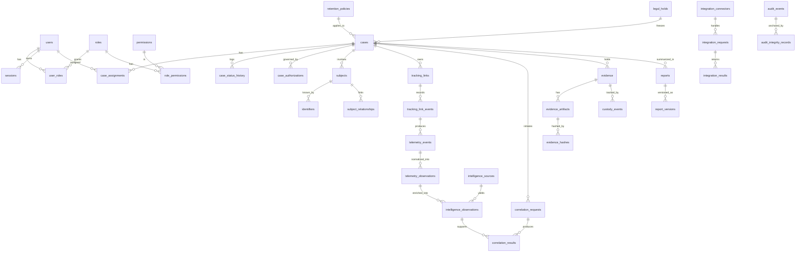

# DILIP — Technical Proposal

**Digital Investigation & Linked Intelligence Platform**
**Enterprise Architecture — Discovery Phase Deliverable**

| | |
|---|---|
| **Document type** | Technical Proposal (Phase 0 — Discovery) |
| **Status** | DRAFT — awaiting architecture review & approval |
| **Version** | 0.1.0 |
| **Date** | 2026-08-11 |
| **Prepared by** | Principal Software Architect / Digital Forensics Platform Engineer / Security Architect |
| **Scope** | Architecture, threat model, data model, security model. **No production code.** |

> **Approval gate.** This document is a *proposal*, not an implementation. Per the brief, no
> production code, migrations, Dockerfiles, APIs, schema changes, deployments, or real external
> integrations are to be produced until this architecture is reviewed and approved. Every place
> where information was not supplied is flagged as **ASSUMPTION** or **OPEN QUESTION** rather than
> guessed.

---

## Table of Contents

1. [Executive Summary](#1-executive-summary)
2. [Current State Assessment](#2-current-state-assessment)
3. [Requirements Decomposition](#3-requirements-decomposition)
4. [Target Architecture](#4-target-architecture)
5. [Module Boundaries](#5-module-boundaries)
6. [Database Schema](#6-database-schema)
7. [Security Architecture](#7-security-architecture)
8. [Evidence Architecture](#8-evidence-architecture)
9. [Audit Architecture](#9-audit-architecture)
10. [Intelligence Architecture](#10-intelligence-architecture)
11. [Phone Identity Correlation Architecture](#11-phone-identity-correlation-architecture)
12. [Geolocation Architecture](#12-geolocation-architecture)
13. [Threat Model](#13-threat-model)
14. [Data Classification & Retention](#14-data-classification--retention)
15. [Deployment Architecture](#15-deployment-architecture)
16. [Testing Strategy](#16-testing-strategy)
17. [Prototype Migration Plan](#17-prototype-migration-plan)
18. [ADR List](#18-adr-list)
19. [Implementation Roadmap](#19-implementation-roadmap)
20. [Open Questions & Assumptions](#20-open-questions--assumptions)

---

## 1. Executive Summary

### 1.1 What DILIP is

DILIP is a **Digital Investigation Evidence & Intelligence Platform**, not a tracking-link tool.
A tracking link is one *collection mechanism* inside a much larger pipeline whose real product is
**legally-defensible, auditable investigative evidence**. The platform's job is to move data along
a controlled path where every step is accountable:

```
Investigation / Case
   → Investigative Action
      → Authorized Collection
         → Telemetry / Intelligence
            → Enrichment
               → Correlation
                  → Human Review
                     → Evidence
                        → Chain of Custody
                           → Audit
                              → Legal / Technical Report
```

### 1.2 The governing principle

The system must **never** silently promote observed telemetry into a statement of identity.
It enforces a strict semantic ladder and preserves the boundary between each rung:

```
Observed Data  →  Enriched Data  →  Correlation  →  Attribution
```

Three non-negotiable truths are baked into the data model, not just the UI:

- **A tracking link ≠ a phone number.**
- **An IP address ≠ a person.**
- **A geolocation ≠ a person's location with certainty.**

Any attribution is the *output of a documented, authorized correlation* carrying source, collection
time, providing authority, and a confidence score — never an inference presented as a fact.

### 1.3 Every result must be answerable

For **every** data point the platform holds, an investigator, supervisor, auditor, or court must be
able to answer, from the record itself:

> Where did it come from? When was it collected? By what method? Under what authority? Who accessed
> it? Has it changed? What is our confidence in it? How does it link to other evidence? Who
> approved it?

If those questions cannot be answered, the data is **not legal-grade evidence**, however polished
the interface is. This requirement drives the provenance, custody, and audit architecture below.

### 1.4 What we are proposing

- Evolve the single-file FastAPI + SQLite + CDN-React prototype into a **modular monolith**
  (FastAPI backend, separately-built React frontend, PostgreSQL) with clearly bounded modules that
  can later be extracted into services.
- Treat **provenance, confidence, evidence integrity, chain of custody, and append-only audit** as
  first-class, cross-cutting concerns present from Phase 1 — not features bolted on later.
- Place **all sensitive external contact behind a single Authorized Integration Gateway** with
  authentication, purpose binding, data minimization, and full request/response logging.
- Design for **air-gapped** and **private-cloud** deployment: no CDNs, no external fonts/JS, all
  dependencies vendored and version-pinned.
- Enforce **legal/authorization boundaries** structurally: collection requires a purpose + an
  authorization reference; sensitive correlation requires supervisor review before it becomes
  attribution.

### 1.5 What DILIP explicitly is *not* and will not become

- Not a lawful-interception platform, not an SS7/signaling exploitation tool, not a telecom
  intrusion system. It **receives** authorized results from approved systems through a gateway; it
  does not intercept, hack, or exfiltrate.
- Not a mechanism to extract IMEI, SIM data, MSISDN, or precise GPS from a plain HTTP request. Such
  data, when lawfully available, arrives only through an explicit authorized integration.
- Not an open redirector; tracking endpoints are hardened against SSRF and open-redirect abuse.

---

## 2. Current State Assessment

### 2.1 What the prototype is (as described in the brief)

> **Note.** The prototype source is **not present in this repository** (the repo was empty at the
> start of this engagement). This assessment is therefore based on the description in the brief. A
> line-by-line audit of the actual prototype file is a **Phase 0 follow-up task** — see Open
> Questions. Treat the "current behaviour" claims below as *stated*, to be verified against source.

The prototype is a **proof-of-concept**, explicitly *not* production-ready:

| Aspect | Prototype reality |
|---|---|
| Packaging | A **single Python file** containing backend + frontend |
| API | **FastAPI** |
| Persistence | **SQLite** |
| Frontend | **React SPA** embedded inside a Python string |
| Styling | **Tailwind via CDN** |
| Telemetry | **Synthetic / demo** data |
| Correlation | **Mock** data |
| Identity/RBAC | Presumed minimal or absent (**OPEN QUESTION**) |
| Evidence integrity | Presumed absent (**OPEN QUESTION**) |
| Audit | Presumed a plain table or absent (**OPEN QUESTION**) |

### 2.2 What the prototype proves

- The **concept** and the **workflow shape** (case → action → collection → telemetry → correlation →
  evidence → report) are validated.
- A tracking/telemetry endpoint plus a dashboard is a viable interaction model.

### 2.3 What the prototype cannot do (the gap to close)

- **No trust boundary** between collection, enrichment, correlation, and attribution — the core
  principle of the platform is not enforced.
- **No evidence integrity**: no content-addressed storage, hashing discipline, or tamper-evidence.
- **No chain of custody** as an event stream.
- **No append-only / tamper-evident audit**.
- **No real RBAC / case-level / resource-level authorization**.
- **SQLite** is single-writer, weak on concurrency, integrity constraints, encryption-at-rest, and
  point-in-time recovery — unsuitable for legal-grade multi-user evidence handling.
- **CDN dependencies** (Tailwind, likely React) break air-gapped operation and pin trust to third
  parties.
- **Frontend-in-a-Python-string** cannot be linted, tested, type-checked, or built reproducibly.
- **Open-redirect / SSRF** posture of the tracking endpoint is unverified and likely unsafe.
- **Mock correlation** presents inferences without provenance or confidence — the opposite of the
  required semantics.

The migration disposition for each of these is in [§17](#17-prototype-migration-plan).

---

## 3. Requirements Decomposition

Each requirement from the brief is decomposed into **Functional (FR)**, **Non-Functional (NFR)**,
**Security (SEC)**, and **Compliance (COMP)** requirements. IDs are stable and referenced elsewhere.

### 3.1 Case Management

| ID | Type | Requirement |
|---|---|---|
| FR-CASE-1 | Functional | Support full case lifecycle: DRAFT → OPEN → ACTIVE → UNDER_REVIEW → SUSPENDED → CLOSED → ARCHIVED, with a defined, enforced transition graph. |
| FR-CASE-2 | Functional | Each case carries: deterministic Case ID, case number, title, description, classification, priority, status, assigned investigator, supervising officer, creation timestamp, last activity, legal/authorization reference, retention policy, legal-hold status, related subjects/events/evidence/reports. |
| SEC-CASE-1 | Security | Every lifecycle transition is authorized, audited, timestamped, attributed to a user, and (where required) carries a reason. |
| COMP-CASE-1 | Compliance | A case cannot be created without a legal/authorization reference where policy requires one; retention policy is set at creation. |
| NFR-CASE-1 | Non-functional | Lifecycle transitions are atomic and consistent under concurrency. |

### 3.2 Identifiers

| ID | Type | Requirement |
|---|---|---|
| NFR-ID-1 | Non-functional | IDs are stable, collision-resistant, database-safe, globally unique, and reproducible where required. |
| SEC-ID-1 | Security | `hash()` and other non-cryptographic, process-seeded, or unstable ID mechanisms are prohibited. |
| FR-ID-1 | Functional | Human-facing case numbers are separate from internal primary keys. |

### 3.3 Authorization & Access Control

| ID | Type | Requirement |
|---|---|---|
| SEC-AUTHZ-1 | Security | Roles: Investigator, Supervisor, Auditor, Evidence Viewer, each with the capabilities defined in the brief. |
| SEC-AUTHZ-2 | Security | Auditors can read audit/evidence-access history but **cannot modify evidence**. Evidence Viewer is read-only. |
| SEC-AUTHZ-3 | Security | Combine RBAC with case-level, resource-level, need-to-know, and legal-authorization-boundary checks. |
| SEC-AUTHZ-4 | Security | Sensitive actions (e.g. authorized correlation, telecom integration calls) require supervisor approval. |

### 3.4 Tracking Links & Collection

| ID | Type | Requirement |
|---|---|---|
| FR-TRK-1 | Functional | Create authorized tracking/telemetry links tied to a case, action, purpose, and authorization. |
| FR-TRK-2 | Functional | On visit, collect only browser-legitimate telemetry (timestamp, source IP, User-Agent, browser, OS, device class, language, timezone, screen dimensions, request metadata) subject to deployment/authorization. |
| SEC-TRK-1 | Security | Never assume IMEI, MSISDN, GPS, SIM info, or private device identifiers are obtainable from an HTTP request. |
| SEC-TRK-2 | Security | Destination URLs must pass scheme validation, HTTPS enforcement, domain allowlist, SSRF protection, private-IP/localhost blocking, DNS-rebinding consideration, redirect-chain policy, and URL normalization before use. The tracking endpoint must not become an open redirect. |
| COMP-TRK-1 | Compliance | Every collection is bound to purpose + authorization + data type + retention + access policy (data minimization). |

### 3.5 Data Gathering & Intelligence

| ID | Type | Requirement |
|---|---|---|
| FR-INT-1 | Functional | Data Gathering Engine is built as pluggable collection/enrichment **adapters**: Collection → Normalizer → Validation → Provenance → Enrichment → Correlation. |
| FR-INT-2 | Functional | Intelligence layer is modular: IP, ASN, Geo, OSINT, Device, Network, Identity Correlation, Entity Resolution, Risk Scoring, Timeline. |
| SEC-INT-1 | Security | Every source datum carries source, collection method, timestamp, authorization context, confidence, provenance, data classification, retention. |
| FR-INT-3 | Functional | Every intelligence result is an *observation* (observation + source + timestamp + confidence + provenance + analyst review), never an unqualified fact. |

### 3.6 Correlation

| ID | Type | Requirement |
|---|---|---|
| FR-COR-1 | Functional | Correlation never produces `IP → Person` directly. It produces candidate matches with evidence weighting, confidence, and a required human-review step. |
| FR-COR-2 | Functional | The system can *explain* every correlation ("why were these two entities linked?") with the contributing observations. |
| SEC-COR-1 | Security | Sensitive correlations require supervisor review before becoming attribution. |

### 3.7 Phone / Subscriber Identity Correlation

| ID | Type | Requirement |
|---|---|---|
| FR-PHONE-1 | Functional | Support three **separate** authorized adapters: (1) authorized call/contact records, (2) public OSINT, (3) authorized telecom/network integration. |
| SEC-PHONE-1 | Security | No mechanism for unauthorized access to communications records. DILIP never becomes an interception/intrusion platform. |
| COMP-PHONE-1 | Compliance | Each path records source, timestamp, reference ID, matching attributes, confidence, authorization reference, reviewer, correlation timestamp. |
| FR-PHONE-2 | Functional | Each path documents what *can* and *cannot* be concluded from it. OSINT alone is never conclusive proof of identity. |

### 3.8 Geolocation

| ID | Type | Requirement |
|---|---|---|
| FR-GEO-1 | Functional | Support IP geolocation, Wi-Fi/BSSID intelligence, and cell/network location as separate, non-conflated sources. |
| FR-GEO-2 | Functional | A **Location Fusion** layer weights sources, detects conflicts, computes confidence, and **surfaces disagreement** (never hides it) with per-source explanation. |
| SEC-GEO-1 | Security | IP geo is treated as approximate, not GPS. BSSID/cell data must come from an authorized source; never assume a browser exposes them. |
| FR-GEO-3 | Functional | Location is never presented as precise coordinates when the source does not support that precision; approximation radius/accuracy is stored. |

### 3.9 Evidence, Custody, Integrity

| ID | Type | Requirement |
|---|---|---|
| FR-EVID-1 | Functional | Evidence Vault stores artifacts with full metadata (ID, case, type, filename, MIME, size, SHA-256, optional stronger hash, collection time, collector, source, acquisition method, authorization ref, storage location, classification, retention, legal hold, status). |
| SEC-EVID-1 | Security | Originals are immutable after ingestion (WORM semantics). |
| FR-CUST-1 | Functional | Chain of custody is an **event stream** (not a string); the full custody history is reconstructable. |
| SEC-EVID-2 | Security | Integrity is *provable*: content-addressed storage, hash verification, signed manifests, timestamping — able to prove the displayed artifact is byte-identical to the collected one. |

### 3.10 Audit

| ID | Type | Requirement |
|---|---|---|
| SEC-AUD-1 | Security | Audit log is append-only, tamper-evident via cryptographic hash chaining, and backed by immutable/WORM storage. |
| SEC-AUD-2 | Security | A `VERIFY AUDIT INTEGRITY → PASS/FAIL` operation exists and is testable. |
| COMP-AUD-1 | Compliance | Every security-relevant action produces an audit event with actor, role, timestamp, action, before/after state, reason, session/IP context. |

### 3.11 Integration Gateway

| ID | Type | Requirement |
|---|---|---|
| SEC-GW-1 | Security | All sensitive external contact routes through a single Authorized Integration Gateway; no ad-hoc external calls scattered in modules. |
| SEC-GW-2 | Security | Each integration has authentication, authorization, schema validation, request/response logging, timeout, retry, rate limiting, data minimization, classification, provenance, failure isolation. |
| SEC-GW-3 | Security | Integrations cannot directly access the full DILIP database. |
| SEC-GW-4 | Security | mTLS and purpose binding where appropriate; legal authorization reference on every request. |

### 3.12 Security, Deployment, Reliability

| ID | Type | Requirement |
|---|---|---|
| SEC-ENC-1 | Security | Encryption at rest (DB, evidence, backups, secrets, sensitive config) and in transit (TLS, mTLS where needed). |
| SEC-IDN-1 | Security | Strong authentication; JWT/session architecture with refresh/revocation; MFA-ready. |
| SEC-SEC-1 | Security | No secrets in source. Env-based secrets in dev; secret manager/KMS in production. |
| NFR-DEP-1 | Non-functional | Runs air-gapped (all deps vendored, mirrored, version-pinned; no CDN/external JS/fonts/APIs except through the approved boundary) and in private cloud (private PostgreSQL, object storage, DNS, IdP, registry, network segmentation). |
| NFR-REL-1 | Non-functional | Backups + point-in-time recovery + evidence backup + DR with *tested restore*, defined RTO/RPO, health checks, structured logging, metrics, alerting, failure isolation. |

### 3.13 Data Governance

| ID | Type | Requirement |
|---|---|---|
| COMP-CLASS-1 | Compliance | Classification model: PUBLIC, INTERNAL, CONFIDENTIAL, RESTRICTED, HIGHLY_RESTRICTED; every data object knows its classification. |
| COMP-MIN-1 | Compliance | Data minimization: no collection without purpose + authorization + type + retention + access policy. |
| COMP-RET-1 | Compliance | Retention policies and legal holds are enforced; legal hold overrides deletion. |
| FR-SEM-1 | Functional | The system distinguishes FACT vs INTELLIGENCE vs CORRELATION vs ANALYST CONCLUSION and never auto-promotes inference to fact. |

### 3.14 Reporting & Frontend

| ID | Type | Requirement |
|---|---|---|
| FR-REP-1 | Functional | Professional, **versioned** reports containing case metadata, timeline, actions, intelligence observations, correlation results, evidence references + hashes, chain of custody, audit summary, analyst conclusions, confidence levels, data sources, limitations, authorization references. |
| FR-UI-1 | Functional | Separate `frontend/` and `backend/`; local build pipeline; no CDN. Dashboard: case overview, timeline, event explorer, intelligence graph, correlation workspace, evidence vault, custody viewer, audit viewer, reports, user/access management, system health. |

---

## 4. Target Architecture

### 4.1 Architectural style

**Modular monolith first.** A single deployable backend with strong internal module boundaries,
each module owning its domain, service layer, repository, API surface, and tests. Boundaries are
drawn so any module (e.g. Integrations, Intelligence) can be extracted into a separate service
later without a rewrite. We reject premature microservices: they would multiply the security
surface, the audit-consistency problem, and operational cost before the domain is stable.

See **ADR-0001** (modular monolith) and **ADR-0002** (module boundary rules).

### 4.2 High-level component view

```
┌──────────────────────────────────────────────────────────────┐
│                     React Frontend (built, no CDN)             │
│  Case UI · Timeline · Event Explorer · Intel Graph ·          │
│  Correlation Workspace · Evidence Vault · Custody · Audit ·   │
│  Reports · Access Mgmt · System Health                        │
└───────────────────────────────┬──────────────────────────────┘
                                 │  HTTPS (mTLS optional), JWT/session
                                 ▼
┌──────────────────────────────────────────────────────────────┐
│                     API Layer (FastAPI)                        │
│  AuthN · AuthZ (RBAC + case/resource/need-to-know) ·          │
│  Input validation · Rate limiting · Structured request log     │
└───────────────────────────────┬──────────────────────────────┘
                                 │  in-process module calls (typed)
        ┌────────────┬───────────┼───────────┬───────────┬─────────────┐
        ▼            ▼           ▼           ▼           ▼             ▼
   ┌────────┐  ┌──────────┐ ┌─────────┐ ┌──────────┐ ┌─────────┐ ┌───────────┐
   │identity│  │  cases   │ │collect. │ │intellig. │ │correlat.│ │ evidence  │
   └────────┘  └──────────┘ └─────────┘ └──────────┘ └─────────┘ └───────────┘
        │            │           │           │           │             │
        └──────┬─────┴─────┬─────┴─────┬─────┴─────┬─────┴──────┬──────┘
               ▼           ▼           ▼           ▼            ▼
          ┌────────┐  ┌─────────┐            ┌───────────┐  ┌──────────────┐
          │ audit  │  │reporting│            │integrations│ │  telemetry   │
          └────────┘  └─────────┘            └─────┬──────┘ └──────────────┘
               │                                    │
   ┌───────────┼────────────────────────────────┐  │
   ▼           ▼                                 ▼  ▼
┌──────────────────┐  ┌────────────────┐  ┌────────────────────────────┐
│   PostgreSQL     │  │ Evidence Store  │  │ Authorized Integration      │
│ (relational,     │  │ (content-       │  │ Gateway (single egress      │
│  encrypted)      │  │  addressed,     │  │ boundary: authN, mTLS,      │
│                  │  │  WORM)          │  │ purpose binding, logging)   │
└──────────────────┘  └────────────────┘  └────────────┬───────────────┘
        │                                               ▼
┌──────────────────┐                        ┌────────────────────────────┐
│  Audit Store     │                        │  Approved External Systems  │
│ (append-only,    │                        │  (telecom/network, OSINT,   │
│  hash-chained,   │                        │  IP-intel, Wi-Fi/cell —     │
│  WORM)           │                        │  each behind authorization) │
└──────────────────┘                        └────────────────────────────┘
```

> The diagram in the brief (§28) is honored as a **study baseline**, not a final commitment; the
> above refines it by making the audit store and evidence store explicit peers of the relational DB
> and by collapsing all external contact into the single gateway.

### 4.3 Cross-cutting concerns (present from Phase 1)

- **Provenance envelope**: every externally-sourced datum is wrapped with source, method, time,
  authorization, classification, confidence, retention — enforced at the repository layer.
- **Semantic tier tagging**: every stored claim is tagged FACT / INTELLIGENCE / CORRELATION /
  CONCLUSION (see [§10.5](#105-fact-vs-intelligence-vs-conclusion)).
- **Audit interceptor**: security-relevant service methods emit audit events transactionally.
- **AuthZ decision point**: a single policy engine consulted by every module (RBAC + case +
  resource + need-to-know + legal boundary).

### 4.4 Technology baseline (proposed, subject to ADRs)

| Concern | Choice | ADR |
|---|---|---|
| Backend framework | FastAPI (kept from prototype) | ADR-0003 |
| Language runtime | Python 3.12+ | ADR-0003 |
| Relational DB | PostgreSQL 16+ | ADR-0004 |
| Identifiers | UUIDv7 primary; ULID for sortable public tokens; UUIDv5 for deterministic derivations | ADR-0005 |
| Evidence storage | Content-addressed object store (SHA-256 address), WORM | ADR-0006 |
| Audit storage | Append-only table + hash chain + periodic anchored WORM export | ADR-0007 |
| Frontend | React + Vite, self-hosted build, no CDN | ADR-0008 |
| Secrets | Env in dev; KMS/secret manager in prod | ADR-0009 |
| External egress | Single Integration Gateway | ADR-0010 |
| AuthN/session | Short-lived JWT access + rotating refresh, server-side revocation | ADR-0011 |

---

## 5. Module Boundaries

Each module exposes a typed service interface, owns its tables (no cross-module raw SQL), and is
independently testable. Cross-module access goes through service interfaces only.

```
backend/modules/
    identity/       — users, roles, permissions, sessions, MFA, authZ policy engine
    cases/          — case lifecycle, assignments, authorizations, subjects, timeline
    collection/     — tracking links, destination validation, collection tasks, adapters
    telemetry/      — telemetry ingestion, normalization, observation store
    intelligence/   — IP/ASN/Geo/OSINT/Device/Network enrichment modules, risk, timeline
    correlation/    — entity resolution, candidate matching, confidence, review workflow
    evidence/       — evidence vault, hashing, custody event stream, integrity verification
    audit/          — append-only audit, hash chain, integrity verification
    reporting/      — report composition, versioning, signed export
    integrations/   — Authorized Integration Gateway, connector registry, purpose binding
```

| Module | Responsibility | Owns (primary tables) | Key collaborators |
|---|---|---|---|
| **identity** | Authentication, sessions, MFA, RBAC + authZ policy decisions | users, roles, permissions, user_roles, sessions | every module (policy checks) |
| **cases** | Case lifecycle & authorization, assignments, subjects/identifiers, timeline aggregation | cases, case_assignments, case_status_history, case_authorizations, subjects, identifiers, subject_relationships | identity, audit |
| **collection** | Authorized tracking links, destination-URL security, collection tasks | tracking_links, tracking_link_events, collection_tasks | telemetry, cases, audit |
| **telemetry** | Ingest raw telemetry, normalize, store observations with provenance | telemetry_events, telemetry_observations | intelligence, evidence, audit |
| **intelligence** | Pluggable enrichment (IP, ASN, geo, OSINT, device, network), risk scoring | intelligence_sources, intelligence_observations | integrations, correlation, audit |
| **correlation** | Entity resolution, candidate generation, confidence, human-review workflow | correlation_requests, correlation_results | intelligence, cases, evidence, audit |
| **evidence** | Immutable artifact storage, hashing, custody stream, integrity verification, retention/legal-hold | evidence, evidence_artifacts, evidence_hashes, custody_events | cases, audit |
| **audit** | Append-only, hash-chained audit + integrity verification | audit_events, audit_integrity_records | all (consumers) |
| **reporting** | Compose versioned reports, signed/versioned export | reports, report_versions | cases, evidence, correlation, audit |
| **integrations** | Single egress boundary; connector registry, auth, schema validation, purpose binding, logging | integration_connectors, integration_requests, integration_results | intelligence, correlation, audit |

**Boundary rules (enforced, ADR-0002):**
1. A module never reads another module's tables directly — only its service interface.
2. All external network calls originate in `integrations`; other modules request results.
3. `audit` is write-through for mutating operations and read-only for `auditor`.
4. `evidence` originals are write-once; no update/delete path exists in its interface.

---

## 6. Database Schema

**Engine:** PostgreSQL 16+. Enums via native `CREATE TYPE`. Soft-deletion only where legally
permissible (`deleted_at`, never for evidence/audit). Timestamps are `timestamptz` (UTC). Primary
keys are UUIDv7 (`id uuid`). Human identifiers (case numbers, evidence numbers) are separate unique
columns.

### 6.1 Logical ERD



### 6.2 Table catalogue

Below, each table lists its purpose, key columns, and integrity rules. `PK` = primary key, `FK` =
foreign key, `UQ` = unique, `IX` = index, `CK` = check constraint.

#### Identity & access

- **users** — PK `id`; UQ `username`, `email`; `display_name`, `status` (enum: ACTIVE, SUSPENDED,
  LOCKED, DISABLED), `mfa_enrolled bool`, `password_credential_ref` (never the secret itself),
  `created_at`, `last_login_at`. CK: status in enum.
- **roles** — PK `id`; UQ `name` (INVESTIGATOR, SUPERVISOR, AUDITOR, EVIDENCE_VIEWER, ADMIN);
  `description`.
- **permissions** — PK `id`; UQ `code` (e.g. `case.transition`, `evidence.read`,
  `correlation.approve`); `description`.
- **role_permissions** — PK (`role_id`,`permission_id`); FKs to roles/permissions.
- **user_roles** — PK (`user_id`,`role_id`); FKs; optional `scope_case_id` FK for case-scoped grants
  (need-to-know). IX on `user_id`.
- **sessions** — PK `id`; FK `user_id`; `refresh_token_hash`, `issued_at`, `expires_at`,
  `revoked_at`, `ip`, `user_agent`. IX `user_id`, `expires_at`.

#### Cases & subjects

- **cases** — PK `id` (UUIDv7); UQ `case_number`; `title`, `description`, `classification` (enum),
  `priority` (enum), `status` (enum lifecycle), `assigned_investigator_id` FK users,
  `supervising_officer_id` FK users, `created_at`, `last_activity_at`, `retention_policy_id` FK,
  `legal_hold_id` FK nullable, `legal_authorization_ref`. CK: status in lifecycle enum. IX on
  `status`, `assigned_investigator_id`.
- **case_assignments** — PK `id`; FK `case_id`, `user_id`; `role_in_case`, `assigned_at`,
  `assigned_by`, `unassigned_at`. UQ (`case_id`,`user_id`, active).
- **case_status_history** — PK `id`; FK `case_id`; `from_status`, `to_status`, `changed_by` FK
  users, `changed_at`, `reason`, `authorization_ref`. Append-only (no update/delete).
- **case_authorizations** — PK `id`; FK `case_id`; `authorization_type`, `reference`, `issued_by`,
  `valid_from`, `valid_to`, `scope`, `document_evidence_id` FK evidence nullable.
- **subjects** — PK `id`; FK `case_id`; `label`, `subject_type` (PERSON, ORG, DEVICE, ACCOUNT,
  UNKNOWN), `classification`, `notes`. Subjects are *investigative entities*, not confirmed
  identities.
- **identifiers** — PK `id`; FK `subject_id`; `identifier_type` (IP, EMAIL, PHONE, USERNAME, BSSID,
  IMEI, HANDLE…), `value`, `confidence`, `first_seen`, `last_seen`, `provenance_ref`. IX
  (`identifier_type`,`value`).
- **subject_relationships** — PK `id`; FK `subject_a_id`, `subject_b_id`; `relationship_type`,
  `confidence`, `basis` (correlation_result_id nullable), `created_at`.

#### Collection & telemetry

- **tracking_links** — PK `id`; FK `case_id`, `created_by`; UQ `token` (ULID/opaque);
  `destination_url` (validated), `destination_status` (enum: PENDING_VALIDATION, ALLOWED, BLOCKED),
  `purpose`, `authorization_ref`, `classification`, `retention_policy_id` FK, `active bool`,
  `created_at`, `expires_at`. CK: destination must be ALLOWED before link is active.
- **tracking_link_events** — PK `id`; FK `tracking_link_id`; `occurred_at`, `source_ip`,
  `raw_request_meta jsonb`, `redirect_decision`. Append-only.
- **collection_tasks** — PK `id`; FK `case_id`, `created_by`; `adapter`, `purpose`,
  `authorization_ref`, `status`, `params jsonb` (minimized), `created_at`.
- **telemetry_events** — PK `id`; FK `tracking_link_event_id` nullable, `case_id`; `event_type`,
  `occurred_at`, `ingested_at`, `raw jsonb`, `classification`, `provenance_ref`. Append-only.
- **telemetry_observations** — PK `id`; FK `telemetry_event_id`; `observation_type` (IP, UA, OS,
  DEVICE_CLASS, LANG, TZ, SCREEN…), `value`, `confidence`, `semantic_tier` (=FACT), `provenance_ref`.

#### Intelligence & correlation

- **intelligence_sources** — PK `id`; UQ `name`; `source_type` (IP_INTEL, ASN, GEO, OSINT, DEVICE,
  NETWORK), `reliability`, `connector_id` FK integration_connectors nullable, `version`,
  `data_classification`.
- **intelligence_observations** — PK `id`; FK `source_id`, `telemetry_observation_id` nullable,
  `case_id`; `observation jsonb`, `confidence`, `semantic_tier` (=INTELLIGENCE), `collected_at`,
  `authorization_ref`, `provenance_ref`, `analyst_review_id` nullable, `retention_policy_id` FK.
- **correlation_requests** — PK `id`; FK `case_id`, `requested_by`; `question`, `inputs jsonb`,
  `authorization_ref`, `status` (PENDING, RUNNING, AWAITING_REVIEW, APPROVED, REJECTED),
  `created_at`.
- **correlation_results** — PK `id`; FK `correlation_request_id`; `candidate jsonb`,
  `confidence numeric`, `evidence_weighting jsonb`, `explanation` (the "why"), `semantic_tier`
  (=CORRELATION until human-approved → ATTRIBUTION), `reviewed_by` FK users nullable, `reviewed_at`,
  `review_decision`, `provenance_ref`. CK: becomes attribution only when `review_decision=APPROVED`.

#### Evidence & custody

- **evidence** — PK `id`; UQ `evidence_number`; FK `case_id`; `artifact_type`, `classification`,
  `retention_policy_id` FK, `legal_hold_id` FK nullable, `status` (enum: COLLECTED, VERIFIED,
  RELEASED, SEALED), `collected_at`, `collector_id` FK users, `source`, `acquisition_method`,
  `authorization_ref`. No UPDATE to integrity-bearing columns after ingestion (enforced by trigger +
  interface).
- **evidence_artifacts** — PK `id`; FK `evidence_id`; `original_filename`, `mime_type`, `size_bytes`,
  `storage_address` (content hash = address), `storage_location`, `sealed bool`. UQ
  `storage_address` (content-addressed dedupe).
- **evidence_hashes** — PK `id`; FK `evidence_artifact_id`; `algorithm` (SHA-256, SHA-512),
  `hash_value`, `computed_at`, `computed_by`. Multiple rows allow multi-algorithm proof.
- **custody_events** — PK `id`; FK `evidence_id`, `actor_id`; `role`, `occurred_at`, `action`
  (COLLECTED, ACCESSED, TRANSFERRED, SEALED, VERIFIED, EXPORTED…), `previous_state`, `new_state`,
  `reason`, `session_id`, `source_ip`, `integrity_meta jsonb`. Append-only; forms the custody stream.

#### Audit

- **audit_events** — PK `id` (UUIDv7, monotonic); `seq bigint` UQ (gap-checked); `actor_id`,
  `role`, `action`, `resource_type`, `resource_id`, `occurred_at`, `before jsonb`, `after jsonb`,
  `reason`, `session_id`, `source_ip`, `event_hash`, `prev_event_hash`. Append-only; `event_hash =
  H(canonical(event) || prev_event_hash)`.
- **audit_integrity_records** — PK `id`; `from_seq`, `to_seq`, `chain_head_hash`, `anchored_at`,
  `anchor_location` (WORM export ref), `signature`. Periodic checkpoints for fast verification and
  external anchoring.

#### Reporting

- **reports** — PK `id`; FK `case_id`; `title`, `current_version_id` FK report_versions,
  `created_by`, `created_at`, `status`.
- **report_versions** — PK `id`; FK `report_id`; `version_no`, `content_ref` (content-addressed),
  `content_hash`, `generated_by`, `generated_at`, `approved_by` nullable, `signature` nullable,
  `included_evidence jsonb` (evidence IDs + hashes snapshot). Immutable once approved.

#### Integrations

- **integration_connectors** — PK `id`; UQ `name`; `connector_type`, `endpoint`, `auth_method`
  (MTLS, OAUTH, APIKEY), `purpose_binding`, `data_classification`, `rate_limit`, `enabled bool`.
  Secrets referenced by KMS handle, never stored inline.
- **integration_requests** — PK `id`; FK `connector_id`, `requested_by`, `case_id`; `purpose`,
  `authorization_ref`, `request_meta jsonb` (minimized), `requested_at`, `status`. Append-only.
- **integration_results** — PK `id`; FK `integration_request_id`; `result_meta jsonb`, `confidence`,
  `provenance_ref`, `received_at`, `data_classification`, `retention_policy_id` FK. Raw payloads
  retained only if authorized.

#### Governance

- **retention_policies** — PK `id`; UQ `name`; `retention_period`, `disposition` (DELETE, ANONYMIZE,
  REVIEW), `legal_basis`.
- **legal_holds** — PK `id`; FK `case_id` nullable (can be broader); `reason`, `issued_by`,
  `issued_at`, `released_at` nullable, `scope`. While active, blocks deletion/disposition of scoped
  objects.

### 6.3 Cross-cutting schema conventions

- **Provenance**: `provenance_ref` columns point to a provenance record (source, method, time,
  authorization, classification, confidence). Modelled as a shared `provenance` table (PK `id`,
  `source`, `method`, `collected_at`, `authorization_ref`, `classification`, `confidence`,
  `notes`) referenced widely. *(Added to the logical model; not in the brief's list but required by
  the governing principle — see ADR-0012.)*
- **Enum strategy**: native PostgreSQL enums for closed sets; lookup tables where values evolve.
- **Soft deletion**: only for non-integrity objects; evidence, custody, audit, and status-history
  tables are strictly append-only (enforced by triggers + revoked UPDATE/DELETE grants).
- **Indexes**: FK columns, high-cardinality lookup columns (`identifiers(value)`,
  `audit_events(resource_id)`), and time-range columns (`*_at`) are indexed.

---

## 7. Security Architecture

### 7.1 Identity & authentication

- Password credentials stored only as strong salted hashes (Argon2id, tuned). **MFA-ready**: TOTP
  first-class, WebAuthn as an extension point.
- **Sessions**: short-lived JWT access tokens (minutes) + rotating refresh tokens stored
  server-side by hash, enabling immediate revocation (logout, compromise, role change). See
  ADR-0011.
- Token claims are minimal; authorization is resolved server-side at each request, never trusted
  from the token alone.

### 7.2 Authorization (defense in depth)

A single **policy decision point** consulted by every module, layering:

1. **RBAC** — role → permission codes.
2. **Case-level** — is the user assigned to (or supervising) this case?
3. **Resource-level** — object ownership/scope checks (prevents IDOR).
4. **Need-to-know** — case-scoped grants (`user_roles.scope_case_id`).
5. **Legal-authorization boundary** — does the action's `authorization_ref` cover this operation and
   is it currently valid?

Role capability summary:

| Capability | Investigator | Supervisor | Auditor | Evidence Viewer |
|---|:--:|:--:|:--:|:--:|
| Create/manage authorized cases | ✅ | ✅ | ❌ | ❌ |
| Execute investigative actions | ✅ | ✅ | ❌ | ❌ |
| Create collection tasks | ✅ | ✅ | ❌ | ❌ |
| Create evidence records | ✅ | ✅ | ❌ | ❌ |
| Approve sensitive actions / correlation | ❌ | ✅ | ❌ | ❌ |
| Manage case lifecycle / approve reports | ❌ | ✅ | ❌ | ❌ |
| Read audit logs & access history | ❌ | ✅ | ✅ | ❌ |
| Verify record integrity | ❌ | ✅ | ✅ | ❌ |
| **Modify evidence** | ❌ (append/collect only) | ❌ | ❌ | ❌ |
| Read authorized evidence | ✅ | ✅ | view access history only | ✅ (read-only) |

> No role can *modify* an original evidence artifact — immutability is structural, not role-based.

### 7.3 Encryption

- **At rest**: PostgreSQL transparent/volume encryption + column-level encryption for the most
  sensitive fields (identifiers, integration payloads); evidence store encrypted; **backups
  encrypted**; secrets in KMS; sensitive config encrypted.
- **In transit**: TLS everywhere; **mTLS** between DILIP core and the Integration Gateway, and
  between the gateway and approved external systems.
- **Certificate management**: internal CA in air-gapped/private-cloud mode; documented rotation.

### 7.4 Secrets

- **No secrets in source** (enforced by secret-scanning in CI — see [§16](#16-testing-strategy)).
- Dev: environment variables / local `.env` excluded from VCS.
- Prod: KMS / secret manager; application receives short-lived, scoped credentials.

### 7.5 Application security controls

- Input validation at the API boundary (Pydantic models); output encoding in the frontend.
- CORS locked to known origins; strict CSP (no external origins — supports air-gap).
- Rate limiting on auth, tracking endpoints, and gateway calls.
- SSRF/open-redirect defenses on tracking destinations (see [§10.6](#106-tracking-destination-url-security)).
- Parameterized queries / ORM only; no string-built SQL.

---

## 8. Evidence Architecture

### 8.1 Evidence Vault

Not a table — a subsystem enforcing **immutability + provable integrity + custody**.

```
Ingestion:
  artifact bytes
     → compute SHA-256 (and SHA-512 for high-value)
        → storage_address = content hash  (content-addressed store, WORM)
           → write evidence + evidence_artifacts + evidence_hashes (single tx)
              → emit custody_event(action=COLLECTED)
                 → emit audit_event
```

Once ingested, the artifact is **write-once**. There is no update or delete path in the evidence
interface. Deletion is possible only through a governed retention/disposition workflow, and **never**
while a legal hold is active.

### 8.2 Integrity — proving sameness

The requirement is not "we have a hash" but "we can prove the artifact shown now is the artifact
collected then." Mechanisms:

- **Content-addressed storage**: the storage key *is* the SHA-256 digest, so a mismatched byte
  cannot resolve to the same address.
- **Multi-algorithm hashes** (SHA-256 + SHA-512) for high-value evidence, guarding against a single
  algorithm's future weakness.
- **Signed manifests**: per-case and per-export manifests list `{evidence_number, storage_address,
  hashes}` and are cryptographically signed.
- **Timestamping**: manifests carry trusted timestamps (RFC-3161-style) to bind *when* integrity was
  attested.
- **Verification operation**: `VERIFY EVIDENCE` recomputes hashes from stored bytes and compares to
  `evidence_hashes` and the signed manifest → PASS/FAIL, itself audited.

See ADR-0006.

### 8.3 Chain of custody as an event stream

Custody is **not** a status string. It is an append-only stream of `custody_events`:

```
Evidence ──▶ custody_event(COLLECTED) ──▶ custody_event(ACCESSED)
         ──▶ custody_event(VERIFIED)  ──▶ custody_event(SEALED)
         ──▶ custody_event(EXPORTED)
```

Each event records actor, role, timestamp, action, previous state, new state, reason, session/IP,
and integrity metadata. The **complete history is reconstructable** by replaying the stream — a
requirement for legal defensibility.

### 8.4 Retention & legal hold

- Every evidence object references a retention policy; disposition runs only after the period and
  only if no legal hold applies.
- A **legal hold** freezes disposition immediately and is itself audited (issued_by, reason).

---

## 9. Audit Architecture

### 9.1 Append-only, tamper-evident

Audit is not an ordinary editable table. Design:

```
Application action
   → Audit Event (canonicalized)
      → event_hash = H(canonical(event) || prev_event_hash)
         → append-only store (UPDATE/DELETE grants revoked)
            → periodic checkpoint → audit_integrity_records (chain head, signed)
               → export to immutable / WORM storage
```

Each event chains to its predecessor by hash, so altering or removing any event breaks the chain
from that point forward. A monotonic `seq` provides gap detection independent of the hash chain.

### 9.2 Verification

`VERIFY AUDIT INTEGRITY`:
1. Recompute the hash chain from the last trusted checkpoint (or genesis).
2. Check `seq` continuity (no gaps/reordering).
3. Compare the recomputed chain head to the signed `audit_integrity_records` head.
4. Return **PASS / FAIL** with the first divergent `seq` if FAIL. The verification run is itself
   audited.

### 9.3 Scope & retention

- Every security-relevant action across all modules emits an audit event, written **transactionally**
  with the action it describes (no "best effort" logging for security events).
- Audit retention is governed and typically the longest in the system; audit is never subject to
  routine soft-deletion.

See ADR-0007.

---

## 10. Intelligence Architecture

### 10.1 Pipeline

```
Collection Adapter → Normalizer → Validation → Provenance → Enrichment → Correlation
```

Every stage preserves and extends the provenance envelope; nothing advances without source, method,
time, authorization, classification, and confidence.

### 10.2 Modular intelligence layer

Independent, pluggable modules, each producing *observations* (never bare facts):

`IP Intelligence · ASN Intelligence · Geo Intelligence · OSINT · Device Intelligence · Network
Intelligence · Identity Correlation · Entity Resolution · Risk Scoring · Timeline Analysis`

Each result = **observation + source + timestamp + confidence + provenance + analyst review**.

### 10.3 Collection/enrichment adapters

Adapters are pluggable and uniform: they implement a common interface (`collect`, `normalize`,
`validate`, `enrich`) and declare their source, classification, and authorization requirements. New
sources are added as adapters without touching the core.

### 10.4 Correlation engine

Correlation **never** emits `IP → Person`. It emits:

```
Observations → Candidate Matches → Evidence Weighting → Confidence → Correlation Result → Human Review
```

and can **explain** every link. Worked example (from the brief):

```
CASE-2026-0042
  → IP observed at 14:32                (FACT)
  → matched against authorized subscriber dataset via timestamp/network context  (INTELLIGENCE)
  → candidate subscriber                (CORRELATION, confidence 92%)
  → REQUIRES Supervisor Review          → on approval becomes ATTRIBUTION
```

Confidence, contributing observations, and provenance are stored so the "why" is reproducible.

### 10.5 Fact vs Intelligence vs Conclusion

Every stored claim carries a `semantic_tier`:

| Tier | Meaning | Example |
|---|---|---|
| **FACT** | Directly observed & recorded | "IP 185.x.x.x was observed at T." |
| **INTELLIGENCE** | Derived from a source, attributed | "IP is associated with ASN X per source Y." |
| **CORRELATION** | Candidate link with confidence | "Observed IP correlates with subscriber record X (92%)." |
| **CONCLUSION** | Analyst assessment | "Investigator assesses that…" |

The system **never auto-promotes** a lower tier to a higher one. Promotion of CORRELATION →
ATTRIBUTION requires an explicit, audited human decision.

### 10.6 Tracking destination-URL security

The tracking endpoint must not become an **open redirect** or **SSRF** vector. Before a destination
is marked `ALLOWED`:

- Scheme validation (reject non-`http(s)`), **HTTPS enforcement**.
- **Domain allowlist**; URL normalization to defeat obfuscation.
- **SSRF protection**: resolve and reject private/loopback/link-local/internal ranges; block
  `localhost`; consider **DNS-rebinding** (re-validate at request time, not just at creation).
- **Redirect-chain policy**: bounded, validated at each hop.
- Full **logging** of decisions.

Clear separation is enforced:

```
Tracking Endpoint → Collection → Validated Destination
```

Collection and redirection are distinct steps; the redirect only fires to a pre-validated,
re-checked destination.

---

## 11. Phone Identity Correlation Architecture

**Core rule:** a tracking link cannot extract a phone number. Any subscriber/phone attribution is
the product of an *authorized, documented correlation* through one of three **separate** adapters.
None of them turns an HTTP request into an MSISDN.

### 11.1 Method 1 — Authorized Call/Contact Records

```
Observed Identifier → Authorized Records → Matching/Correlation → Subscriber Candidate
   → Confidence Score → Human Review
```

Stored: record source, record time, reference ID, matching attributes, confidence, authorization
reference, reviewer, correlation timestamp.

| | |
|---|---|
| **Can conclude** | A *candidate* subscriber consistent with authorized records, pending human review. |
| **Cannot conclude** | A confirmed identity without review; anything beyond the authorization's scope. |
| **Guardrail** | No mechanism for unauthorized access to communications records is designed or built. |

### 11.2 Method 2 — Public OSINT

```
Public Identifier → OSINT Sources → Entity Resolution → Candidate Identity
   → Cross-source Validation → Confidence
```

Stored: URL/source, collection timestamp, source reliability, extracted fact, evidence
snapshot/hash, confidence, analyst notes.

| | |
|---|---|
| **Can conclude** | Publicly-associated candidate leads, cross-source corroborated. |
| **Cannot conclude** | Final proof of identity from OSINT **alone** — never conclusive by itself. |
| **Guardrail** | Snapshots are hashed and stored as evidence with provenance; OSINT stays INTELLIGENCE tier. |

### 11.3 Method 3 — Authorized Telecom / Signaling / Network Integration

Only when the operating authority holds legal authorization and a formal integration with an
approved provider. DILIP **receives** results; it does not intercept.

```
DILIP → Authorized Integration Gateway → Approved Telecom/Network System
      → Authorized Result → DILIP Correlation Engine
```

Controls: strong authentication, **mTLS**, request authorization, **purpose binding**, audit, data
minimization, rate limiting, response provenance, legal authorization reference. Raw telecom data is
stored **only** if required and authorized.

| | |
|---|---|
| **Can conclude** | An authorized correlation result provided by the approved system, with provenance. |
| **Cannot conclude** | Anything DILIP itself "derived" from the network — it derives nothing; it records what the authorized system returned. |
| **Guardrail (hard boundary)** | DILIP must **never** become a platform for intercepting communications or intruding on telecom networks. It is a consumer of authorized results only. |

---

## 12. Geolocation Architecture

Multiple sources, **never conflated**, each with explicit precision limits, provenance, and
confidence.

### 12.1 Method 1 — IP Geolocation

```
Source IP → IP Intelligence Provider / Local DB → {Country, Region, City, ASN, Network}
   → Approximate Location
```

Stored: provider/DB version, lookup timestamp, result, confidence, approximation radius. **Treated
as approximate — not GPS.**

### 12.2 Method 2 — Wi-Fi / BSSID Intelligence

```
BSSID → Authorized Wi-Fi Intelligence Dataset → Known Location Candidate → Confidence
```

Stored: BSSID (where legally appropriate), source, timestamp, dataset version, location result,
confidence, provenance. **A normal browser does not expose BSSID** — the identifier must come from an
authorized source/collection environment.

### 12.3 Method 3 — Cell / Network Location

```
Cell/Network Observations → Authorized Network Source → Cell Location Model
   → Approximate Geographic Area → Confidence/Accuracy
```

Supports multiple observations, timestamp correlation, confidence, estimated accuracy, source
provenance. **Never presented as precise coordinates** when the source does not support that
precision.

### 12.4 Location Fusion Layer

Not three silos — a fusion layer that combines IP geo + Wi-Fi/BSSID + cell/network + optional
authorized GPS:

```
Location Observations → Source weighting → Conflict detection → Confidence calculation
   → Approximate location → Analyst review
```

**Disagreement is surfaced, never hidden:**

```
Source A → Amman        Source B → Zarqa        Source C → Unknown
                        Status → CONFLICT
```

with each result's source and explanation preserved.

| Source | Precision | Depends on |
|---|---|---|
| IP Geo | Country/city, approximate radius | provider DB accuracy |
| Wi-Fi/BSSID | Building/AP-level *when* dataset covers it | authorized dataset + authorized BSSID capture |
| Cell/Network | Cell-area, model-estimated accuracy | authorized network source |
| Authorized GPS | Precise *if and only if* lawfully provided | authorized device integration |

---

## 13. Threat Model

Methodology: enumerate actors and abuse cases, then rate Impact / Likelihood, define Mitigation and
Residual Risk. This is a Phase-0 baseline to be deepened before implementation (STRIDE per module).

### 13.1 Actors

External attacker · Malicious insider · Compromised investigator account · Compromised integration ·
Court/oversight (legitimate scrutiny — a design *audience*, not a threat).

### 13.2 Abuse cases & mitigations

| # | Threat | Impact | Likelihood | Mitigation | Residual |
|---|---|---|---|---|---|
| T1 | External attacker breaches API | High | Med | TLS, strong authN, rate limiting, input validation, least privilege, network segmentation | Low–Med |
| T2 | Malicious insider exfiltrates data | High | Med | Need-to-know + case-level authZ, data classification, audit of every access, data minimization, DLP at egress | Med |
| T3 | Compromised investigator account | High | Med | MFA, short-lived tokens + revocation, anomaly detection, supervisor approval for sensitive actions | Med |
| T4 | Compromised integration/connector | High | Low–Med | Gateway isolation, mTLS, per-connector scope, no direct DB access, schema validation, failure isolation | Low |
| T5 | Malicious input (injection/XSS) | High | Med | Parameterized queries/ORM, Pydantic validation, output encoding, strict CSP | Low |
| T6 | Malicious destination URL (SSRF/open-redirect) | High | Med | Scheme/HTTPS enforcement, allowlist, private-IP blocking, DNS-rebinding re-check, redirect policy | Low |
| T7 | Database compromise | Critical | Low | Encryption at rest, column encryption for sensitive fields, key separation via KMS, least-privilege DB roles | Med |
| T8 | **Evidence tampering** | Critical | Low | Content-addressed WORM store, multi-hash, signed manifests, immutable custody stream, verification op | Low |
| T9 | **Audit tampering** | Critical | Low | Append-only store, hash chaining, seq gap detection, signed checkpoints, WORM export, verify op | Low |
| T10 | Data exfiltration via reports/export | High | Med | Classification-aware export, approval workflow, watermarking/signing, audit of exports | Med |
| T11 | **Unauthorized correlation / over-attribution** | High (rights impact) | Med | Mandatory human review, semantic-tier separation, authorization-boundary checks, purpose binding | Med |
| T12 | Secret leakage in source/logs | High | Med | No secrets in source, secret scanning in CI, log redaction, KMS | Low |
| T13 | Air-gap violation (external fetch) | Med | Med | Vendored deps, strict CSP, egress only via gateway, build-time dependency pinning | Low |

**Highest-priority invariants:** evidence integrity (T8), audit integrity (T9), and prevention of
unauthorized/over-confident attribution (T11) — these define whether output is legal-grade.

---

## 14. Data Classification & Retention

### 14.1 Classification model

`PUBLIC · INTERNAL · CONFIDENTIAL · RESTRICTED · HIGHLY_RESTRICTED` — every data object declares its
class; access and export policy derive from it.

| Class | Example data | Handling |
|---|---|---|
| PUBLIC | Published OSINT snapshot | Standard controls |
| INTERNAL | Case metadata, non-sensitive config | Authenticated access |
| CONFIDENTIAL | Telemetry observations, IP-geo results | Case-scoped + need-to-know |
| RESTRICTED | Subject identifiers, correlation results | Supervisor-gated actions, column encryption |
| HIGHLY_RESTRICTED | Authorized telecom results, subscriber candidates, legal authorizations | mTLS-only source, strictest need-to-know, longest audit, column encryption |

### 14.2 Retention & minimization

- **Data minimization** (COMP-MIN-1): nothing is collected without purpose + authorization + type +
  retention + access policy. Tracking links and collection tasks cannot exist without these fields.
- **Retention policies** define period + disposition (DELETE / ANONYMIZE / REVIEW) + legal basis.
- **Legal hold** overrides disposition; evidence and audit are never routinely deleted.
- Raw integration/telecom payloads are retained only when explicitly authorized; otherwise only
  minimized results + provenance are kept.

---

## 15. Deployment Architecture

### 15.1 Mode A — Air-gapped

- **No** CDN, external JS, external fonts, or external APIs except through the approved gateway.
- All dependencies **vendored, mirrored, locally hosted, version-pinned** (frontend and backend).
- Internal CA for TLS/mTLS; strict CSP with no external origins.
- Frontend served as a locally-built static bundle.

### 15.2 Mode B — Private Cloud

- Private PostgreSQL (with PITR), private object storage (WORM-capable for evidence/audit), internal
  DNS, internal identity provider, private container registry, network segmentation between tiers
  (frontend / API / data / gateway).
- The Integration Gateway sits in its own segment; only it may egress to approved external systems.

### 15.3 Topology (both modes)

```
[Segmented network]
  Frontend tier (static bundle)  →  API tier (FastAPI, modular monolith)
                                       ├─ Data tier: PostgreSQL (encrypted, PITR)
                                       ├─ Evidence store (content-addressed, WORM)
                                       ├─ Audit store (append-only, WORM export)
                                       └─ Integration Gateway segment ──▶ Approved external systems
```

### 15.4 Reliability (must be *proven*, not asserted)

Required and to be **demonstrated**, not claimed:

```
Backup → Restore → Verification → RTO → RPO
```

- Database backups + **point-in-time recovery**; evidence + audit backups.
- **Restore testing** on a schedule (a backup that has never been restored is not a backup).
- Defined **RTO/RPO** (values are an OPEN QUESTION — business input needed).
- Health checks, structured logging, metrics, alerting, failure isolation between modules and the
  gateway.

---

## 16. Testing Strategy

| Layer | Coverage |
|---|---|
| **Unit** | Domain logic per module (lifecycle transitions, confidence math, semantic-tier rules, URL validation). |
| **Integration** | PostgreSQL + evidence store + gateway (with stub connectors); migrations; transactional audit. |
| **Security** | AuthN, authZ, **IDOR**, **SSRF**, **open redirect**, injection, CORS/CSP, session handling, **secrets exposure** (secret scanning in CI). |
| **Evidence** | Hash verification, **tamper detection**, custody-sequence correctness, export integrity. |
| **Audit** | Append-only enforcement, hash-chain integrity, **tamper detection**, seq-gap detection, verify PASS/FAIL. |
| **End-to-end** | Create Case → Authorized Collection → Telemetry → Enrichment → Correlation → Evidence → Review → Report → **Audit Verification**. |

Security and integrity tests (SSRF, open-redirect, evidence-tamper, audit-tamper) are **release
gates**, not optional. The E2E scenario doubles as the acceptance test for the whole pipeline.

---

## 17. Prototype Migration Plan

Nothing is rewritten blindly. Disposition per component, with rationale.

| Prototype Component | Keep | Refactor | Replace | Remove | Rationale |
|---|:--:|:--:|:--:|:--:|---|
| **FastAPI** | ✅ | | | | Solid async API framework; validates well with Pydantic. Reorganize into modular structure. |
| **SQLite** | | | ✅ | | Single-writer, weak concurrency/integrity/encryption/PITR. Replace with PostgreSQL (ADR-0004). |
| **React SPA** | | ✅ | | | Keep React; extract from the Python string into a real `frontend/` with Vite build (ADR-0008). |
| **Tailwind (CDN)** | | ✅ | | | Keep Tailwind; **self-host** via local build. CDN breaks air-gap (remove CDN, not Tailwind). |
| **Tracking Links** | | ✅ | | | Concept kept; harden destination validation, SSRF/open-redirect defenses, provenance, authorization binding. |
| **Events (telemetry)** | | ✅ | | | Keep event capture; add normalization, provenance envelope, semantic-tier tagging, real store. |
| **Evidence** | | | ✅ | | Prototype has no real vault. Replace with content-addressed WORM store + hashing + custody stream. |
| **Audit** | | | ✅ | | Replace any plain/absent audit with append-only, hash-chained, WORM-exported audit. |
| **Users / RBAC** | | ✅ | | | Keep the notion; build real RBAC + case/resource/need-to-know + MFA-ready sessions. |
| **Mock correlation data** | | | | ✅ | Remove. Replace with real correlation engine emitting candidates + confidence + provenance + review. Mocks violate the provenance principle. |
| **Synthetic/demo telemetry** | | | | ✅ | Remove from production paths; retain only as clearly-labelled test fixtures. |
| **Single-file packaging** | | | ✅ | | Replace with modular monolith layout; untestable monolith-in-a-string cannot be a production baseline. |

---

## 18. ADR List

Architecture Decision Records to be authored and approved (skeletons under `docs/adr/`). Each ADR
captures context, options, decision, and consequences.

| ADR | Decision | Why it needs an ADR |
|---|---|---|
| ADR-0001 | Modular monolith over microservices (first) | Foundational structure & extraction path |
| ADR-0002 | Module boundary & dependency rules | Enforces isolation, enables later extraction |
| ADR-0003 | FastAPI + Python 3.12 backend | Baseline runtime |
| ADR-0004 | PostgreSQL over SQLite | Integrity, concurrency, encryption, PITR |
| ADR-0005 | Identifier strategy (UUIDv7 / ULID / UUIDv5) | Stable, sortable, collision-resistant; bans `hash()` |
| ADR-0006 | Content-addressed WORM evidence store + multi-hash + signed manifests | Provable evidence integrity |
| ADR-0007 | Append-only, hash-chained audit + WORM anchoring | Tamper-evident audit |
| ADR-0008 | Separate React+Vite frontend, self-hosted (no CDN) | Air-gap, testability, reproducible build |
| ADR-0009 | Secrets via env (dev) / KMS (prod) | No secrets in source |
| ADR-0010 | Single Authorized Integration Gateway for all external egress | Contain and audit external contact |
| ADR-0011 | Short-lived JWT + rotating server-side refresh tokens | Revocable sessions, MFA-ready |
| ADR-0012 | Provenance envelope as a first-class shared model | Enforces the governing principle universally |
| ADR-0013 | Semantic tiers (FACT/INTELLIGENCE/CORRELATION/CONCLUSION) with no auto-promotion | Prevents inference-as-fact |
| ADR-0014 | Mandatory human review before attribution | Legal defensibility of correlation |
| ADR-0015 | Data classification & retention model | Governance & minimization |

*(An index and skeletons are provided in `docs/adr/`.)*

---

## 19. Implementation Roadmap

Ordered by **risk and dependency**, not by coding ease. Security, provenance, evidence, and audit
foundations come before features that depend on them.

| Phase | Name | Focus | Exit criteria |
|---|---|---|---|
| **0** | **Discovery** *(this document)* | Requirements, threat model, architecture, ADRs, data model, security model | Architecture **approved** |
| **1** | Foundation | Repo structure, PostgreSQL, migrations, config, identity, RBAC, logging, **audit foundation** | AuthN/Z + append-only audit working & verifiable |
| **2** | Case Management | Cases, assignments, lifecycle, authorization, timeline | Full lifecycle enforced & audited |
| **3** | Collection & Telemetry | Tracking-link architecture, **validated destinations**, ingestion, normalization | SSRF/open-redirect tests pass; telemetry stored with provenance |
| **4** | Intelligence | IP/ASN/Geo/OSINT adapters, observations, provenance | Enrichment produces tiered observations |
| **5** | Correlation | Entity resolution, **authorized integration boundary**, confidence, analyst review | Correlation explainable + human-review gate |
| **6** | Evidence Vault | Artifact storage, hashing, custody events, integrity verification, retention/legal hold | Evidence tamper tests pass; custody reconstructable |
| **7** | Reporting | Case reports, evidence/audit references, signed/versioned exports | Versioned, signed report from real data |
| **8** | Enterprise Hardening | Security testing, DR, **backup-restore verification**, deployment, observability, pen-test, ops docs | RTO/RPO demonstrated; pen-test findings closed |

**Sequencing rationale:** audit and identity (Phase 1) underpin everything; evidence and correlation
(5–6) depend on provenance established in 3–4; hardening (8) validates the whole against real
adversarial and reliability requirements.

---

## 20. Open Questions & Assumptions

Per the brief, nothing absent from the source material is silently assumed. Items needing owner
input before or during Phase 1:

### Assumptions

- **ASSUMPTION** — The prototype matches the brief's description (single-file FastAPI + SQLite +
  CDN-React + mock data). To be **verified** against actual source, which was not present in this
  repository.
- **ASSUMPTION** — Python 3.12+ and PostgreSQL 16+ are acceptable baseline versions.
- **ASSUMPTION** — Evidence artifact volumes are within object-store scale (not petabyte media
  forensics) for the initial deployment; storage sizing to be confirmed.
- **ASSUMPTION** — A single operating authority/tenant initially (multi-tenancy is out of scope
  until raised).

### Open Questions

- **OPEN QUESTION** — Concrete **RTO/RPO** targets and backup retention windows? (Business/legal
  input.)
- **OPEN QUESTION** — Which **legal/regulatory regime(s)** govern retention, authorization
  references, and evidence admissibility? This shapes retention defaults and report content.
- **OPEN QUESTION** — Which **identity provider** in private-cloud mode (internal IdP protocol:
  OIDC/SAML/LDAP)? Affects Phase 1 identity design.
- **OPEN QUESTION** — Which **approved external systems** (IP-intel provider, OSINT sources, telecom
  integration) are actually available, and under what authorization? Determines which adapters are
  built in Phases 4–5.
- **OPEN QUESTION** — Is **WORM-capable object storage** available in the target environment
  (evidence/audit anchoring depends on it), or must WORM be emulated at the application layer?
- **OPEN QUESTION** — Expected **user scale / concurrency** and case volume (sizing, indexing, and
  whether/when module extraction is warranted)?
- **OPEN QUESTION** — **MFA** method required (TOTP vs WebAuthn/hardware keys) for Phase 1?
- **OPEN QUESTION** — Signing/timestamping trust anchor for manifests and reports (internal CA vs
  external TSA in a possibly air-gapped environment)?
- **OPEN QUESTION** — Data-residency / cross-border constraints on any external correlation results?

---

*End of Technical Proposal v0.1.0 — awaiting architecture review and approval. No implementation to
begin until this document is approved.*
