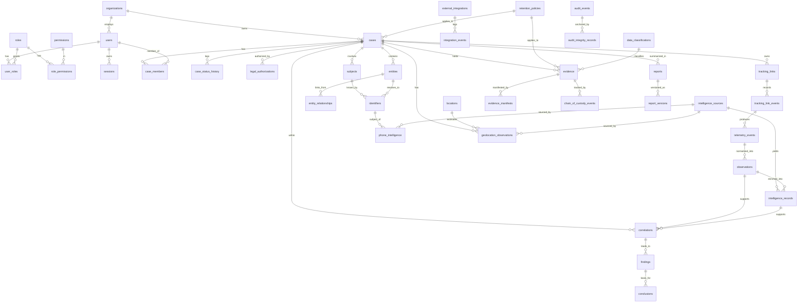

# DILIP — Logical Data Model

Expanded from [Technical Proposal §6](../DILIP-TECHNICAL-PROPOSAL.md#6-data-model-logical-erd). This
is a **logical** model for review — not a migration. No DDL is authored in Phase 0.

## Conventions

- **Engine:** PostgreSQL 16+.
- **Primary keys:** `uuid` (UUIDv7, ADR-002). Human identifiers (`case_number`, `evidence_number`)
  are separate unique columns.
- **Time:** `timestamptz`, UTC. **Enums:** native for closed sets; lookup tables where values evolve.
- **Isolation:** every case-scoped table carries `organization_id` + `case_id`; **row-level
  security** enforces case/tenant isolation (ADR-006).
- **Append-only** (no UPDATE/DELETE): `case_status_history`, `tracking_link_events`,
  `telemetry_events`, `chain_of_custody_events`, `audit_events`, `integration_events`.
- **Immutable after ingestion:** `evidence`, `evidence_manifests` (integrity columns), approved
  `report_versions`.
- **Soft deletion** (`deleted_at`): only non-integrity objects (never evidence/custody/audit).
- **Provenance & confidence:** externally-sourced rows carry `source`, `collection_method`,
  `authorization_ref`, `collected_at`, `confidence`, `classification`, `semantic_tier` where
  applicable (ADR-011).

## Logical ERD

## Entity Graph model (§20)

Nodes are rows in **`entities`** (`entity_type ∈ {Person, Device, Phone, IP, Domain, URL, Account,
Email, Location, BSSID, Cell, Case, Evidence, Observation, Organization}`). Edges are rows in
**`entity_relationships`**:

| Column | Meaning |
|---|---|
| `from_entity_id`, `to_entity_id` | FK entities |
| `type` | ASSOCIATED_WITH · OBSERVED_ON · RESOLVES_TO · BELONGS_TO · LOCATED_AT · CONNECTED_TO · MENTIONED_IN · SUPPORTED_BY · CONTRADICTS |
| `confidence` | numeric |
| `provenance_ref` | source/method/time/authorization |
| `basis` | correlation_id / evidence_id supporting the edge |

`CONTRADICTS` edges make conflicts first-class graph facts (INT-5). A native graph DB is deferred
(ADR-007); the relational edge model suffices for Phase 3 and keeps the store unified.

## Table groups (brief §25 mapped)

| Group | Tables |
|---|---|
| Tenancy | organizations |
| Identity & access | users, roles, permissions, role_permissions, user_roles, sessions |
| Cases & entities | cases, case_members, case_status_history, legal_authorizations, subjects, entities, identifiers, entity_relationships |
| Tracking & telemetry | tracking_links, tracking_link_events, telemetry_events, observations |
| Intelligence | intelligence_sources, intelligence_records |
| Phone | phone_intelligence |
| Geolocation | locations, geolocation_observations |
| Correlation | correlations, findings, conclusions |
| Evidence & custody | evidence, evidence_manifests, chain_of_custody_events |
| Audit | audit_events, audit_integrity_records |
| Integrations | external_integrations, integration_events |
| Governance | retention_policies, data_classifications |
| Reporting | reports, report_versions |

*Additions beyond the brief's list, required by the governing principle:* `organizations` (tenancy),
`entity_relationships` (graph edges), `report_versions` (versioning), `audit_integrity_records`
(anchoring), `role_permissions`/`user_roles` (RBAC join), `data_classifications`.

## Semantic-tier column

`observations`, `intelligence_records`, `correlations` carry `semantic_tier` (FACT / INTELLIGENCE /
CORRELATION / CONCLUSION / ATTRIBUTION). No auto-promotion (ADR-011); `CORRELATION → CONCLUSION`
requires an audited human action (ADR-011).

## Integrity enforcement points

| Requirement | Mechanism |
|---|---|
| Evidence immutability | Content-addressed store + revoked UPDATE/DELETE + no-mutate interface (ADR-003) |
| Custody tamper-evidence | Hash-linked append-only `chain_of_custody_events` (ADR-004) |
| Audit tamper-evidence | Hash chain + monotonic `seq` + signed WORM anchor (ADR-005) |
| Case/tenant isolation | `organization_id`+`case_id` scoping + row-level security (ADR-006) |
| Provenance completeness | `source`/`authorization_ref`/`confidence` NOT NULL on externally-sourced rows |
| Destination safety | `tracking_links.destination_status = ALLOWED` required before activation |
| Legal-hold precedence | active legal hold blocks disposition/deletion at the repository layer (ADR-013) |
| No inference-as-fact | `semantic_tier` guard; promotion only via audited human action (ADR-011) |
