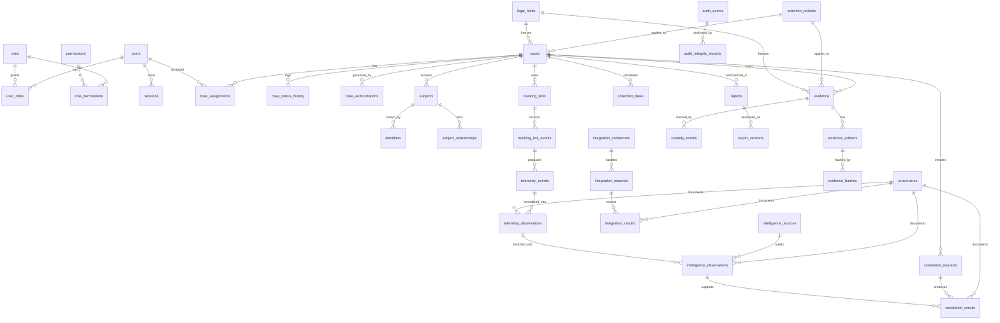

# DILIP — Logical Data Model

Expanded from [Technical Proposal §6](../DILIP-TECHNICAL-PROPOSAL.md#6-database-schema). This is a
**logical** model for review — not a migration. No DDL is authored in Phase 0.

## Conventions

- **Engine:** PostgreSQL 16+.
- **Primary keys:** `uuid` (UUIDv7). Human identifiers (`case_number`, `evidence_number`) are
  separate unique columns.
- **Time:** `timestamptz`, UTC.
- **Enums:** native PostgreSQL enums for closed sets; lookup tables where values evolve.
- **Append-only tables** (no UPDATE/DELETE): `case_status_history`, `tracking_link_events`,
  `telemetry_events`, `custody_events`, `audit_events`, `integration_requests`.
- **Immutable-after-ingestion:** `evidence`, `evidence_artifacts`, `evidence_hashes` (integrity
  columns), approved `report_versions`.
- **Soft deletion** (`deleted_at`): only for non-integrity objects (never evidence/audit/custody).
- **Provenance:** a shared `provenance` table referenced by `provenance_ref` across telemetry,
  intelligence, correlation, and integration results (ADR-0012).

## Logical ERD

## Table groups

The full column-level catalogue is in
[Technical Proposal §6.2](../DILIP-TECHNICAL-PROPOSAL.md#62-table-catalogue). Groups:

| Group | Tables |
|---|---|
| Identity & access | users, roles, permissions, role_permissions, user_roles, sessions |
| Cases & subjects | cases, case_assignments, case_status_history, case_authorizations, subjects, identifiers, subject_relationships |
| Collection & telemetry | tracking_links, tracking_link_events, collection_tasks, telemetry_events, telemetry_observations |
| Intelligence & correlation | intelligence_sources, intelligence_observations, correlation_requests, correlation_results |
| Evidence & custody | evidence, evidence_artifacts, evidence_hashes, custody_events |
| Audit | audit_events, audit_integrity_records |
| Reporting | reports, report_versions |
| Integrations | integration_connectors, integration_requests, integration_results |
| Governance | retention_policies, legal_holds, provenance |

## Semantic-tier column

Claim-bearing tables (`telemetry_observations`, `intelligence_observations`, `correlation_results`)
carry a `semantic_tier` value: `FACT`, `INTELLIGENCE`, `CORRELATION`, or (post-review) `ATTRIBUTION`
/ `CONCLUSION`. The application enforces **no auto-promotion** between tiers (ADR-0013); promotion of
`CORRELATION → ATTRIBUTION` requires an audited human decision (ADR-0014).

## Integrity enforcement points

| Requirement | Mechanism |
|---|---|
| Evidence immutability | Revoked UPDATE/DELETE grants + content-addressed store + interface with no mutate path |
| Audit tamper-evidence | Hash chain (`event_hash`, `prev_event_hash`) + monotonic `seq` + signed checkpoints |
| Custody reconstructability | Append-only `custody_events` stream replayed in order |
| Provenance completeness | `provenance_ref` NOT NULL on externally-sourced observations |
| Destination safety | `tracking_links.destination_status = ALLOWED` required before `active = true` |
| Legal hold precedence | `legal_holds` active → disposition/deletion blocked at the repository layer |
